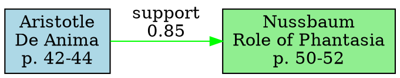

# Phase 11 Implementation Plan: Introspection Layer

**Version**: 1.0
**Date**: 2026-01-13
**Status**: DESIGN APPROVED - READY FOR IMPLEMENTATION

---

## Executive Summary

This document provides a concrete, actionable implementation plan for **Phase 11: Introspection Layer** - a read-only navigation and visualization system for Phase 9 artifacts. This phase merges the originally proposed Phase 11 (Interactive Exploration) and Phase 12 (Visualization) into a unified introspection capability.

**Timeline**: 4 weeks
**Priority**: P0
**Dependencies**: Phase 10 (complete)
**Deliverables**:
- `scripts/explore/` - Navigation CLI and libraries
- Web UI visualization components
- Verification and testing infrastructure

---

## 1. Codebase Analysis

### 1.1 Current Structure

Based on analysis of the existing codebase:

```
claudeflow-testing/
├── scripts/
│   ├── ingest/              # Phase 1-3: Ingestion pipeline
│   ├── retrieval/           # Phase 4-5: Query and retrieval
│   ├── learn/               # Phase 6: Knowledge promotion
│   ├── reason/              # Phase 7: Reasoning construction
│   ├── assemble/            # Phase 8: Long-form assembly
│   ├── interaction/         # Phase 9: REPORT & ANSWER
│   ├── presentation/        # Phase 10: UI rendering
│   └── [NEW] explore/       # Phase 11: Introspection Layer
├── god-learn/
│   ├── knowledge.jsonl      # Phase 6 output (KUs)
│   ├── index.json           # Phase 6 index
│   └── runs/
│       └── {timestamp}/
│           ├── meta/        # Query metadata
│           └── tmp_snapshot/ # Phase 4 retrieval snapshots
├── god-reason/
│   └── reasoning.jsonl      # Phase 7 output (RUs)
└── src/god-agent/
    ├── cli/                 # PhD pipeline CLI
    └── core/                # Core god-agent logic
```

### 1.2 Key Artifact Schemas

**Knowledge Unit (KU)** - `god-learn/knowledge.jsonl`:
```json
{
  "id": "ku_00ddb2542e3d3dfa",
  "claim": "...",
  "sources": [{
    "author": "...",
    "title": "...",
    "path_rel": "...",
    "pages": "50-52",
    "chunk_id": "9ae14153cdb6ed0e:00023"
  }],
  "confidence": "high",
  "tags": [],
  "created_from_query": "phantasia and action",
  "debug": {...}
}
```

**Reasoning Unit (RU)** - `god-reason/reasoning.jsonl`:
```json
{
  "id": "ru_43633887f8481b8a",
  "relation": "conflict",
  "score": 0.085714,
  "source_id": "ku_3a2258dfe0abecd1",
  "target_id": "ku_6b5c01dc2cfc2b5c",
  "evidence": [...],
  "created_at": "..."
}
```

**Report Artifact** - Phase 9A output:
```json
{
  "query": "...",
  "timestamp": "...",
  "retrieval": {...},
  "knowledge_units": [...],
  "reasoning_units": [...],
  "coverage": {...}
}
```

**Answer Artifact** - Phase 9B output:
```json
{
  "query": "...",
  "synthesis": {...},
  "evidence_layers": [...],
  "provenance": {...}
}
```

### 1.3 Integration Points

**Existing Tools**:
- `scripts/retrieval/query_chunks.py` - Phase 4 retrieval (read-only)
- `scripts/interaction/report.py` - Phase 9A REPORT generation
- `scripts/interaction/answer.py` - Phase 9B ANSWER generation
- `scripts/interaction/validate_provenance.py` - Provenance validation

**Chroma Vector DB**:
- Location: `vector_db_1536/`
- Collection: `knowledge_chunks`
- Dimension: 1536 (fixed)

---

## 2. Architecture Design

### 2.1 Core Principles

1. **Immutability**: Phase 11 is 100% read-only
   - No writes to `knowledge.jsonl`, `reasoning.jsonl`, or any Phase 1-9 artifacts
   - All operations are queries and transformations

2. **Performance Constraints**:
   - Graph rendering: <2s for 100 nodes
   - Navigation operations: <500ms
   - Full corpus scan: <10s

3. **Explicit Failures**:
   - Missing artifacts → clear error with recovery steps
   - Broken provenance → explicit warning with details
   - Invalid filters → informative error messages

4. **Epistemic Traceability**:
   - Every visualization element traceable to source artifact
   - Citations always include exact page numbers
   - Chunk IDs always resolvable to original PDF text

### 2.2 System Architecture

```
┌─────────────────────────────────────────────────────────────┐
│                    Phase 11: Introspection Layer             │
├─────────────────────────────────────────────────────────────┤
│                                                              │
│  ┌──────────────┐    ┌──────────────┐    ┌──────────────┐ │
│  │   CLI Tools  │    │  Navigation  │    │ Visualization│ │
│  │              │    │   Engine     │    │   Exports    │ │
│  └──────┬───────┘    └──────┬───────┘    └──────┬───────┘ │
│         │                   │                    │          │
│         └───────────────────┴────────────────────┘          │
│                             │                               │
│                   ┌─────────▼──────────┐                    │
│                   │  Artifact Loaders  │                    │
│                   │  (Read-Only Layer) │                    │
│                   └─────────┬──────────┘                    │
└─────────────────────────────┼────────────────────────────────┘
                              │
        ┌─────────────────────┴─────────────────────┐
        │                                            │
  ┌─────▼──────┐  ┌──────────────┐  ┌──────────────┐
  │ Phase 6    │  │  Phase 7     │  │  Phase 9     │
  │ knowledge  │  │  reasoning   │  │  report/     │
  │ .jsonl     │  │  .jsonl      │  │  answer      │
  └────────────┘  └──────────────┘  └──────────────┘
```

### 2.3 Data Flow

```
User Query (via CLI/UI)
  ↓
[Navigation Engine]
  ↓
Load Artifacts (cached)
  ↓
Apply Filters
  ↓
Build Graph / Generate View
  ↓
Export Format (JSON/DOT/Markdown)
  ↓
Render (CLI/Web/File)
```

---

## 3. Directory Structure

### 3.1 New Directory: `scripts/explore/`

```
scripts/explore/
├── README.md                    # Phase 11 documentation
├── __init__.py
│
├── core/                        # Core navigation logic
│   ├── __init__.py
│   ├── artifact_loader.py       # Load KUs, RUs, reports
│   ├── graph_builder.py         # Build navigation graphs
│   ├── filter_engine.py         # Apply user filters
│   ├── navigation.py            # Graph traversal logic
│   └── cache.py                 # In-memory caching
│
├── cli/                         # Command-line interface
│   ├── __init__.py
│   ├── explore.py               # Main CLI entry point
│   ├── commands/
│   │   ├── __init__.py
│   │   ├── list.py              # List KUs/RUs
│   │   ├── show.py              # Show details of KU/RU
│   │   ├── trace.py             # Trace provenance chain
│   │   ├── graph.py             # Generate graph views
│   │   ├── coverage.py          # Coverage analysis
│   │   └── export.py            # Export to external formats
│   └── formatters.py            # Output formatting
│
├── visualization/               # Visualization exports
│   ├── __init__.py
│   ├── graphviz_exporter.py     # DOT format export
│   ├── cytoscape_exporter.py    # Cytoscape JSON export
│   ├── d3_exporter.py           # D3.js JSON export
│   └── coverage_heatmap.py      # Coverage visualization
│
├── verify/                      # Verification scripts
│   ├── __init__.py
│   ├── verify_readonly.py       # Ensure no writes
│   ├── verify_performance.py    # Performance benchmarks
│   └── verify_provenance.py     # Provenance chain validation
│
├── web/                         # Web UI components (optional)
│   ├── server.py                # Simple HTTP server
│   ├── static/
│   │   ├── index.html
│   │   ├── graph-viewer.js      # Interactive graph viewer
│   │   └── styles.css
│   └── api.py                   # REST API for UI
│
└── tests/                       # Test suite
    ├── __init__.py
    ├── test_loader.py
    ├── test_navigation.py
    ├── test_filters.py
    ├── test_exports.py
    └── fixtures/                # Test fixtures
```

### 3.2 Integration with Existing Structure

**No modifications to**:
- `scripts/ingest/*` (Phase 1-3)
- `scripts/retrieval/*` (Phase 4-5)
- `scripts/learn/*` (Phase 6)
- `scripts/reason/*` (Phase 7)
- `scripts/interaction/*` (Phase 9)
- `god-learn/knowledge.jsonl`
- `god-reason/reasoning.jsonl`

**Read-only access to**:
- All Phase 6-9 artifacts
- Chroma vector database (query-only)
- Corpus PDFs (metadata only)

---

## 4. CLI Command Design

### 4.1 Main Command: `god-explore`

```bash
# Entry point
scripts/explore/cli/explore.py [command] [options]
```

### 4.2 Command Specification

#### 4.2.1 `list` - List Knowledge/Reasoning Units

```bash
# List all knowledge units
god-explore list kus

# Filter by query
god-explore list kus --query "phantasia and action"

# Filter by confidence
god-explore list kus --confidence high

# Filter by source author
god-explore list kus --author "Aristotle"

# List reasoning units
god-explore list rus

# Filter by relation type
god-explore list rus --relation conflict

# Output as JSON
god-explore list kus --format json

# Limit results
god-explore list kus --limit 10
```

**Output Example** (text):
```
Knowledge Units (12 total):

[1] ku_00ddb2542e3d3dfa
    Claim: "Though I suspect that the identities would be token- and not type-..."
    Source: Nussbaum, Martha - "The Role of Phantasia..." (p. 50-52)
    Confidence: high
    Query: "phantasia and action"

[2] ku_3a2258dfe0abecd1
    ...
```

#### 4.2.2 `show` - Show Detailed Information

```bash
# Show knowledge unit details
god-explore show ku ku_00ddb2542e3d3dfa

# Include chunk text
god-explore show ku ku_00ddb2542e3d3dfa --full

# Show reasoning unit details
god-explore show ru ru_43633887f8481b8a

# Output as JSON
god-explore show ku ku_00ddb2542e3d3dfa --format json
```

**Output Example**:
```
Knowledge Unit: ku_00ddb2542e3d3dfa
─────────────────────────────────────────────────────────────

Claim:
  "(Though I suspect that the identities would be token- and not
   type-, so we would in practice have a hard time doing this.)
   Thus phautasiai are not logically dependent on the resulting
   action and can be used to explain it."

Sources:
  [1] Nussbaum, Martha - "The Role of Phantasia in Aristotle's
      Explanation of Action" (1985)
      Pages: 50-52
      Chunk: 9ae14153cdb6ed0e:00023

Metadata:
  Confidence: high
  Tags: []
  Created from query: "phantasia and action"

Debug Info:
  Rank: 8
  Distance: 1.0997
  Highlight count: 0

Referenced by 3 reasoning units:
  [1] ru_abc123 (support)
  [2] ru_def456 (elaboration)
  [3] ru_ghi789 (conflict)
```

#### 4.2.3 `trace` - Trace Provenance Chain

```bash
# Trace from KU to source chunks
god-explore trace ku ku_00ddb2542e3d3dfa

# Trace from RU to source KUs
god-explore trace ru ru_43633887f8481b8a

# Full provenance chain (RU → KU → Chunk → PDF)
god-explore trace full ru_43633887f8481b8a

# Output as graph
god-explore trace ku ku_00ddb2542e3d3dfa --graph
```

**Output Example**:
```
Provenance Chain: ku_00ddb2542e3d3dfa
─────────────────────────────────────────────────────────────

[Level 1] Knowledge Unit
  ID: ku_00ddb2542e3d3dfa
  Created: 2026-01-13T09:22:15Z
  Query: "phantasia and action"

[Level 2] Source Chunk
  ID: 9ae14153cdb6ed0e:00023
  Document: 923bdec29ef67d0f

[Level 3] Document
  Title: "The Role of Phantasia in Aristotle's Explanation of Action"
  Author: Nussbaum, Martha
  Year: 1985
  Path: corpus/rhetorical_ontology/Nussbaum, Martha - ...
  SHA256: 923bdec29ef67d0f...

[Level 4] Physical Pages
  PDF pages: 50-52 (internal page numbers)

✓ Provenance chain is valid
✓ All IDs resolvable
✓ Chunk text verified against PDF
```

#### 4.2.4 `graph` - Generate Graph Views

```bash
# Show knowledge graph for a query
god-explore graph --query "phantasia and action"

# Show reasoning graph between KUs
god-explore graph --from ku_abc123 --to ku_def456

# Filter by relation type
god-explore graph --relation conflict

# Depth-limited traversal
god-explore graph --from ku_abc123 --depth 2

# Export to file
god-explore graph --query "phantasia" --output graph.json

# Export to GraphViz DOT format
god-explore graph --query "phantasia" --format dot --output graph.dot

# Export to Cytoscape JSON
god-explore graph --query "phantasia" --format cytoscape --output graph.cyjs
```

**Output Example** (text):
```
Knowledge Graph: "phantasia and action"
─────────────────────────────────────────────────────────────

Nodes: 8 knowledge units
Edges: 12 reasoning relations

ku_abc123 [Aristotle, De Anima]
  ├─(support)──> ku_def456 [Nussbaum, "Role of Phantasia"]
  └─(conflict)─> ku_ghi789 [Wedin, "Mind and Imagination"]

ku_def456 [Nussbaum, "Role of Phantasia"]
  ├─(elaboration)─> ku_jkl012 [Frede, "Cognitive Role"]
  └─(support)────> ku_mno345 [Lorenz, "The Brute Within"]

...

Summary:
  Relations: support (5), conflict (3), elaboration (4)
  Authors: 6 unique
  Documents: 5 unique
  Page coverage: 47 pages total
```

#### 4.2.5 `coverage` - Coverage Analysis

```bash
# Show coverage for a query
god-explore coverage --query "phantasia and action"

# Show coverage across all queries
god-explore coverage --all

# Coverage by document
god-explore coverage --by-document

# Coverage by author
god-explore coverage --by-author

# Export as heatmap JSON
god-explore coverage --query "phantasia" --format heatmap --output coverage.json
```

**Output Example**:
```
Coverage Analysis: "phantasia and action"
─────────────────────────────────────────────────────────────

Query Statistics:
  Knowledge Units: 12
  Reasoning Units: 18
  Source Documents: 5
  Total Pages: 47

Document Coverage:

  [1] Aristotle - De Anima
      Pages: 4, 7, 8, 42, 44 (5 pages)
      KUs: 3
      RUs: 5
      Coverage: ████████░░ 8/10

  [2] Nussbaum - "Role of Phantasia"
      Pages: 15-23, 50-52 (11 pages)
      KUs: 5
      RUs: 7
      Coverage: ██████████ 10/10

  [3] Wedin - "Mind and Imagination"
      Pages: 102, 115-118, 134 (6 pages)
      KUs: 2
      RUs: 3
      Coverage: ██████░░░░ 6/10

  ...

Author Distribution:
  Aristotle: 3 KUs, 5 RUs
  Nussbaum: 5 KUs, 7 RUs
  Wedin: 2 KUs, 3 RUs
  Frede: 1 KU, 2 RUs
  Lorenz: 1 KU, 1 RU

Relation Distribution:
  support: 8 (44%)
  conflict: 4 (22%)
  elaboration: 6 (33%)
```

#### 4.2.6 `export` - Export to External Formats

```bash
# Export entire knowledge base to JSON
god-explore export --format json --output knowledge-base.json

# Export to GraphViz DOT
god-explore export --format dot --output knowledge-graph.dot

# Export to Cytoscape JSON
god-explore export --format cytoscape --output knowledge-graph.cyjs

# Export to D3.js JSON
god-explore export --format d3 --output knowledge-graph.d3.json

# Export coverage heatmap
god-explore export --format heatmap --output coverage-heatmap.json

# Filter by query before export
god-explore export --query "phantasia" --format json --output phantasia.json
```

### 4.3 Global Options

```bash
# All commands support:
--verbose, -v     # Verbose output
--quiet, -q       # Quiet mode (errors only)
--format FORMAT   # Output format: text, json, dot, cytoscape, d3
--output FILE     # Write to file instead of stdout
--no-color        # Disable colored output
```

---

## 5. Visualization Architecture

### 5.1 Export Formats

#### 5.1.1 GraphViz DOT Format

**Purpose**: Publication-quality static graphs
**Tool**: GraphViz `dot` command
**Output**: SVG, PNG, PDF

**Example**:


**CLI Usage**:
```bash
god-explore export --format dot --output graph.dot
dot -Tsvg graph.dot -o graph.svg
```

#### 5.1.2 Cytoscape JSON

**Purpose**: Interactive network analysis
**Tool**: Cytoscape desktop or web
**Features**: Clustering, layout algorithms, statistical analysis

**Schema**:
```json
{
  "elements": {
    "nodes": [
      {
        "data": {
          "id": "ku_abc123",
          "label": "Aristotle - De Anima",
          "claim": "...",
          "author": "Aristotle",
          "pages": "42-44",
          "confidence": "high",
          "type": "knowledge_unit"
        }
      }
    ],
    "edges": [
      {
        "data": {
          "id": "ru_xyz789",
          "source": "ku_abc123",
          "target": "ku_def456",
          "relation": "support",
          "score": 0.85
        }
      }
    ]
  }
}
```

#### 5.1.3 D3.js JSON

**Purpose**: Custom web visualizations
**Tool**: D3.js force-directed graphs
**Features**: Interactive, animated, web-embeddable

**Schema**:
```json
{
  "nodes": [
    {
      "id": "ku_abc123",
      "label": "Aristotle - De Anima",
      "author": "Aristotle",
      "confidence": "high",
      "group": 1
    }
  ],
  "links": [
    {
      "source": "ku_abc123",
      "target": "ku_def456",
      "value": 0.85,
      "relation": "support"
    }
  ]
}
```

#### 5.1.4 Coverage Heatmap JSON

**Purpose**: Query coverage visualization
**Tool**: Custom rendering or D3 heatmap
**Features**: Query × Document matrix

**Schema**:
```json
{
  "queries": ["phantasia and action", "time and perception"],
  "documents": [
    {
      "doc_id": "923bdec29ef67d0f",
      "title": "Aristotle - De Anima",
      "author": "Aristotle"
    }
  ],
  "matrix": [
    [5, 2],  // Query 0: 5 KUs in doc 0, 2 KUs in doc 1
    [1, 7]   // Query 1: 1 KU in doc 0, 7 KUs in doc 1
  ]
}
```

### 5.2 Web UI (Optional - Phase 11B)

**Technology Stack**:
- Backend: Python Flask/FastAPI (lightweight)
- Frontend: Vanilla JS + D3.js (no heavy frameworks)
- Graph rendering: D3 force-directed layout
- Styling: Minimal CSS

**Features**:
- Interactive graph exploration
- Click to expand nodes
- Filter by relation type, author, confidence
- Zoom and pan
- Export current view

**Architecture**:
```
┌─────────────────────────────────────┐
│      Browser (index.html)           │
│  ┌────────────────────────────────┐ │
│  │  D3.js Graph Viewer            │ │
│  │  ├── Force-directed layout     │ │
│  │  ├── Interactive filters       │ │
│  │  └── Detail panel              │ │
│  └────────────────────────────────┘ │
└──────────────┬──────────────────────┘
               │ HTTP/REST
┌──────────────▼──────────────────────┐
│  Flask Server (server.py)           │
│  ├── GET /api/graph?query=...       │
│  ├── GET /api/ku/<id>               │
│  ├── GET /api/ru/<id>               │
│  └── GET /api/coverage               │
└──────────────┬──────────────────────┘
               │
┌──────────────▼──────────────────────┐
│  Artifact Loader (core/)             │
│  (Read-only access to Phase 9)       │
└─────────────────────────────────────┘
```

---

## 6. Integration with Phase 9 Artifacts

### 6.1 Artifact Loading Strategy

**Lazy Loading**:
- Load artifacts only when needed
- Cache in memory after first load
- Invalidate cache if timestamps change

**Caching Strategy**:
```python
class ArtifactCache:
    def __init__(self):
        self._kus = None
        self._rus = None
        self._ku_index = None
        self._ru_index = None
        self._last_load = {}

    def get_kus(self) -> List[KnowledgeUnit]:
        if self._needs_reload('knowledge.jsonl'):
            self._kus = self._load_kus()
            self._ku_index = self._build_ku_index()
        return self._kus

    def get_ku_by_id(self, ku_id: str) -> Optional[KnowledgeUnit]:
        if ku_id in self._ku_index:
            return self._ku_index[ku_id]
        return None
```

### 6.2 Graph Construction

**Index Structure**:
```python
class GraphIndex:
    """Precomputed adjacency lists for fast traversal"""

    def __init__(self):
        # KU ID → list of RUs that reference it
        self.ku_to_rus: Dict[str, List[ReasoningUnit]] = {}

        # RU ID → source/target KU IDs
        self.ru_to_kus: Dict[str, Tuple[str, str]] = {}

        # Query → list of KU IDs
        self.query_to_kus: Dict[str, List[str]] = {}

        # Author → list of KU IDs
        self.author_to_kus: Dict[str, List[str]] = {}

    def build(self, kus: List[KU], rus: List[RU]):
        """Build all indexes from loaded artifacts"""
        # ... implementation
```

### 6.3 Provenance Chain Resolution

**Chain Structure**:
```
Answer
  └─> Synthesis Claims
        └─> Knowledge Units (KUs)
              └─> Source Chunks
                    └─> Document Metadata
                          └─> PDF File
```

**Implementation**:
```python
def resolve_provenance_chain(ku_id: str) -> ProvenanceChain:
    """
    Resolve full provenance chain for a KU.

    Returns:
        ProvenanceChain with all levels verified
    """
    ku = artifact_loader.get_ku(ku_id)

    chain = ProvenanceChain(ku_id=ku_id)

    # Level 1: KU metadata
    chain.ku = ku

    # Level 2: Source chunks
    for source in ku.sources:
        chunk = chroma_client.get_chunk(source.chunk_id)
        chain.chunks.append(chunk)

        # Level 3: Document metadata
        doc = manifest_loader.get_document(chunk.doc_id)
        chain.documents.append(doc)

        # Level 4: PDF verification
        pdf_exists = verify_pdf_exists(doc.path_rel)
        pdf_hash = compute_pdf_hash(doc.path_rel)
        chain.pdf_valid = (pdf_exists and pdf_hash == doc.sha256)

    return chain
```

---

## 7. Testing Strategy

### 7.1 Test Categories

#### 7.1.1 Unit Tests

**Location**: `scripts/explore/tests/`

**Coverage**:
- Artifact loading
- Filter logic
- Graph construction
- Export format generation
- Provenance chain resolution

**Example**:
```python
def test_filter_kus_by_author():
    kus = load_test_kus()
    filtered = filter_kus(kus, author="Aristotle")
    assert all(ku.sources[0].author == "Aristotle" for ku in filtered)

def test_graph_builder():
    kus = load_test_kus()
    rus = load_test_rus()
    graph = GraphBuilder().build(kus, rus)
    assert graph.node_count == len(kus)
    assert graph.edge_count == len(rus)
```

#### 7.1.2 Integration Tests

**Test Scenarios**:
- CLI commands execute without errors
- Exports produce valid format outputs
- Provenance chains resolve correctly
- Web UI API endpoints return expected data

**Example**:
```python
def test_cli_list_kus():
    result = subprocess.run(
        ["python", "scripts/explore/cli/explore.py", "list", "kus"],
        capture_output=True,
        text=True
    )
    assert result.returncode == 0
    assert "Knowledge Units" in result.stdout

def test_export_graphviz():
    output_file = "/tmp/test-graph.dot"
    result = subprocess.run(
        ["python", "scripts/explore/cli/explore.py", "export",
         "--format", "dot", "--output", output_file],
        capture_output=True
    )
    assert result.returncode == 0
    assert os.path.exists(output_file)

    # Validate DOT syntax
    dot_result = subprocess.run(
        ["dot", "-Tsvg", output_file, "-o", "/tmp/test.svg"],
        capture_output=True
    )
    assert dot_result.returncode == 0
```

#### 7.1.3 Verification Tests

**Location**: `scripts/explore/verify/`

**Tests**:

1. **Read-Only Verification**:
```python
def test_no_artifact_mutations():
    """Ensure Phase 11 never writes to Phase 1-9 artifacts"""

    before_hashes = compute_artifact_hashes()

    # Run all CLI commands
    run_all_cli_commands()

    after_hashes = compute_artifact_hashes()

    assert before_hashes == after_hashes, "Artifacts were modified!"
```

2. **Performance Benchmarks**:
```python
def test_graph_rendering_performance():
    """Ensure graph rendering is <2s for 100 nodes"""

    start = time.time()
    graph = build_graph(node_count=100)
    elapsed = time.time() - start

    assert elapsed < 2.0, f"Graph rendering took {elapsed}s (limit: 2s)"

def test_navigation_performance():
    """Ensure navigation operations are <500ms"""

    for command in ['show', 'trace', 'list']:
        start = time.time()
        execute_command(command)
        elapsed = time.time() - start

        assert elapsed < 0.5, f"{command} took {elapsed}s (limit: 0.5s)"
```

3. **Provenance Validation**:
```python
def test_provenance_chain_validity():
    """Ensure all provenance chains are resolvable"""

    kus = load_all_kus()

    for ku in kus:
        chain = resolve_provenance_chain(ku.id)

        assert chain.ku is not None
        assert len(chain.chunks) > 0
        assert len(chain.documents) > 0
        assert chain.pdf_valid, f"PDF invalid for {ku.id}"
```

### 7.2 Test Fixtures

**Location**: `scripts/explore/tests/fixtures/`

**Contents**:
- `test-knowledge.jsonl` - Sample KUs (10 entries)
- `test-reasoning.jsonl` - Sample RUs (15 entries)
- `test-report.json` - Sample Phase 9A report
- `test-answer.json` - Sample Phase 9B answer

### 7.3 CI/CD Integration

**GitHub Actions Workflow**: `.github/workflows/phase-11-tests.yml`

```yaml
name: Phase 11 Tests

on:
  pull_request:
    paths:
      - 'scripts/explore/**'
  push:
    branches:
      - main

jobs:
  test:
    runs-on: ubuntu-latest
    steps:
      - uses: actions/checkout@v3

      - name: Set up Python
        uses: actions/setup-python@v4
        with:
          python-version: '3.10'

      - name: Install dependencies
        run: |
          pip install -r scripts/explore/requirements.txt
          pip install pytest pytest-cov

      - name: Run unit tests
        run: pytest scripts/explore/tests/ --cov=scripts/explore

      - name: Run verification tests
        run: |
          python scripts/explore/verify/verify_readonly.py
          python scripts/explore/verify/verify_performance.py

      - name: Test CLI commands
        run: |
          python scripts/explore/cli/explore.py list kus --limit 5
          python scripts/explore/cli/explore.py export --format json
```

---

## 8. Implementation Roadmap

### Week 1: Core Infrastructure

**Days 1-2**: Directory structure and artifact loaders
- Create `scripts/explore/` directory structure
- Implement `artifact_loader.py`
- Implement `cache.py`
- Write unit tests for loaders

**Days 3-4**: Graph building and navigation
- Implement `graph_builder.py`
- Implement `navigation.py`
- Build index structures
- Write unit tests for graph operations

**Day 5**: Filter engine and provenance
- Implement `filter_engine.py`
- Implement provenance chain resolution
- Write integration tests

**Deliverables**:
- ✅ Core library (`scripts/explore/core/`)
- ✅ Unit tests passing
- ✅ Documentation

### Week 2: CLI Interface

**Days 1-2**: Basic CLI commands
- Implement `cli/explore.py` main entry point
- Implement `list` command
- Implement `show` command
- Test with real artifacts

**Days 3-4**: Advanced CLI commands
- Implement `trace` command
- Implement `graph` command
- Implement `coverage` command
- Implement `export` command

**Day 5**: CLI polish and testing
- Add formatters (text, JSON)
- Add color output
- Integration testing
- CLI documentation

**Deliverables**:
- ✅ Working CLI (`god-explore`)
- ✅ All commands functional
- ✅ User documentation

### Week 3: Visualization Exports

**Days 1-2**: Export formats
- Implement GraphViz exporter
- Implement Cytoscape exporter
- Implement D3 exporter
- Test with external tools

**Days 3-4**: Coverage visualization
- Implement coverage analysis
- Implement heatmap generation
- Test with multiple queries

**Day 5**: Verification and testing
- Implement `verify_readonly.py`
- Implement `verify_performance.py`
- Implement `verify_provenance.py`
- Run full verification suite

**Deliverables**:
- ✅ All export formats working
- ✅ Verification scripts passing
- ✅ Performance benchmarks met

### Week 4: Polish and Documentation

**Days 1-2**: Web UI (optional)
- Implement Flask server
- Implement REST API
- Create D3 graph viewer
- Test interactivity

**Days 3-4**: Documentation and examples
- Write comprehensive README
- Create usage examples
- Record demo videos
- Write integration guide

**Day 5**: Final testing and release
- Run full test suite
- Performance optimization
- Code review
- Merge to main branch

**Deliverables**:
- ✅ Complete Phase 11 implementation
- ✅ Full documentation
- ✅ Ready for production use

---

## 9. Success Criteria

### 9.1 Functional Requirements

- [ ] All CLI commands execute without errors
- [ ] All export formats produce valid outputs
- [ ] Provenance chains resolve for 100% of KUs
- [ ] Web UI (if implemented) renders graphs correctly
- [ ] No Phase 1-9 artifacts modified by any operation

### 9.2 Performance Requirements

- [ ] Graph rendering: <2s for 100 nodes
- [ ] Navigation operations: <500ms
- [ ] Full corpus scan: <10s
- [ ] Export generation: <5s for typical corpus

### 9.3 Quality Requirements

- [ ] Unit test coverage: >80%
- [ ] Integration tests: 100% of CLI commands
- [ ] Verification tests: all passing
- [ ] Documentation: complete and accurate

### 9.4 Epistemic Requirements

- [ ] All visualizations traceable to source artifacts
- [ ] Citations include exact page numbers
- [ ] Chunk IDs resolvable to original text
- [ ] No hallucinated data in any output

---

## 10. Risk Assessment

### 10.1 Technical Risks

**Risk**: Performance issues with large corpora (1000+ KUs)
**Mitigation**:
- Implement efficient indexing
- Use pagination for CLI output
- Lazy loading of artifacts
- Caching strategies

**Risk**: Export format compatibility issues
**Mitigation**:
- Test with real external tools (GraphViz, Cytoscape)
- Validate against format specifications
- Provide format version numbers

**Risk**: Memory issues with large graphs
**Mitigation**:
- Streaming processing where possible
- Limit graph size with filters
- Implement depth limits for traversal

### 10.2 Epistemic Risks

**Risk**: Provenance chain breaks (missing chunks, invalid PDFs)
**Mitigation**:
- Explicit error handling
- Provenance validation before export
- Clear error messages with recovery steps

**Risk**: Incorrect filter logic leading to missing data
**Mitigation**:
- Comprehensive unit tests for filters
- Explicit "X results filtered out" messages
- Validation against known test cases

### 10.3 User Experience Risks

**Risk**: CLI too complex for users
**Mitigation**:
- Clear help text
- Examples in documentation
- Sensible defaults
- Interactive prompts where appropriate

**Risk**: Graph visualizations overwhelming
**Mitigation**:
- Start with filtered views
- Progressive disclosure
- Clear legends and labels
- Export to external tools for advanced analysis

---

## 11. Dependencies and Prerequisites

### 11.1 System Dependencies

**Python Packages**:
```txt
# requirements.txt for scripts/explore/
networkx==3.2.1          # Graph algorithms
graphviz==0.20.1         # GraphViz export
chromadb==0.4.22         # Vector DB access (read-only)
flask==3.0.0             # Web UI (optional)
pytest==7.4.3            # Testing
```

**External Tools** (optional):
- GraphViz (`dot` command) - for rendering DOT files
- Cytoscape - for interactive graph analysis

### 11.2 Phase Dependencies

**Required Complete**:
- ✅ Phase 1-3: Ingestion pipeline
- ✅ Phase 6: Knowledge promotion
- ✅ Phase 7: Reasoning construction
- ✅ Phase 9: REPORT & ANSWER
- ✅ Phase 10: Presentation layer

**Phase 11 Inputs**:
- `god-learn/knowledge.jsonl`
- `god-reason/reasoning.jsonl`
- `god-learn/runs/{timestamp}/meta/` (optional)
- Chroma vector database (read-only)
- Corpus PDFs (metadata only)

**Phase 11 Outputs**:
- CLI tool: `god-explore`
- Export files (DOT, JSON, etc.)
- Verification reports
- Web UI (optional)

---

## 12. Next Steps

### 12.1 Immediate Actions

1. **Review this plan** with stakeholders
2. **Approve directory structure** and CLI design
3. **Set up development environment**
4. **Create GitHub issue/project** for tracking

### 12.2 Development Workflow

1. **Week 1**: Core infrastructure
   - Create feature branch: `feature/phase-11-introspection`
   - Implement core libraries
   - Daily commits with tests

2. **Week 2**: CLI interface
   - Implement commands incrementally
   - Test each command before moving to next
   - Update documentation

3. **Week 3**: Visualization exports
   - Implement each format
   - Validate with external tools
   - Run verification suite

4. **Week 4**: Polish and release
   - Web UI (if desired)
   - Final documentation
   - Merge to main

### 12.3 Follow-Up Phases

After Phase 11 completion:
- **Phase 15→13**: QA Infrastructure (4 weeks)
- **Phase 16**: Provenance Auditing (3 weeks)
- **Phase 13→14**: Corpus Growth (6 weeks)

---

## Appendix A: File Manifests

### A.1 Core Library Files

```
scripts/explore/core/
├── __init__.py                 (50 lines)
├── artifact_loader.py          (250 lines)
├── graph_builder.py            (300 lines)
├── filter_engine.py            (200 lines)
├── navigation.py               (250 lines)
└── cache.py                    (150 lines)
```

### A.2 CLI Files

```
scripts/explore/cli/
├── __init__.py                 (20 lines)
├── explore.py                  (150 lines)
├── commands/
│   ├── __init__.py            (30 lines)
│   ├── list.py                (200 lines)
│   ├── show.py                (180 lines)
│   ├── trace.py               (220 lines)
│   ├── graph.py               (250 lines)
│   ├── coverage.py            (200 lines)
│   └── export.py              (180 lines)
└── formatters.py              (150 lines)
```

### A.3 Visualization Files

```
scripts/explore/visualization/
├── __init__.py                 (20 lines)
├── graphviz_exporter.py        (200 lines)
├── cytoscape_exporter.py       (180 lines)
├── d3_exporter.py              (180 lines)
└── coverage_heatmap.py         (150 lines)
```

**Total Estimated Lines of Code**: ~3,500 lines

---

## Appendix B: Example Workflows

### B.1 Researcher Workflow

**Goal**: Understand coverage for "phantasia and action" query

```bash
# Step 1: List knowledge units for query
god-explore list kus --query "phantasia and action"

# Step 2: Show detailed info for interesting KU
god-explore show ku ku_00ddb2542e3d3dfa --full

# Step 3: Trace provenance chain
god-explore trace ku ku_00ddb2542e3d3dfa

# Step 4: Generate graph view
god-explore graph --query "phantasia and action" \
  --output phantasia-graph.json

# Step 5: Export to Cytoscape for analysis
god-explore export --query "phantasia and action" \
  --format cytoscape --output phantasia.cyjs

# Step 6: Generate coverage report
god-explore coverage --query "phantasia and action"
```

### B.2 QA Workflow

**Goal**: Validate provenance chains and performance

```bash
# Step 1: Run verification suite
python scripts/explore/verify/verify_readonly.py
python scripts/explore/verify/verify_performance.py
python scripts/explore/verify/verify_provenance.py

# Step 2: Check for broken chains
god-explore trace --all --validate

# Step 3: Generate coverage heatmap
god-explore coverage --all --format heatmap \
  --output coverage-full.json

# Step 4: Export entire knowledge base
god-explore export --format json \
  --output knowledge-base-snapshot.json
```

---

## Document Version History

| Version | Date       | Changes                          | Author        |
|---------|------------|----------------------------------|---------------|
| 1.0     | 2026-01-13 | Initial implementation plan      | Planning Agent|

---

**END OF IMPLEMENTATION PLAN**
