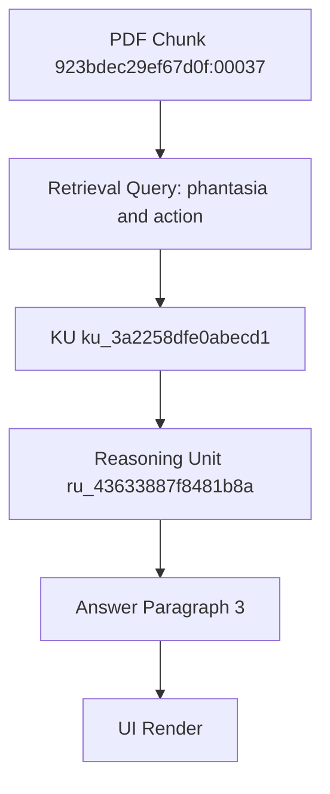

# Architectural Review: God-Learn Phases 11-15

## Executive Summary

Your proposed phases are **architecturally sound** and preserve the core epistemic guarantees established in Phases 1-10. However, I recommend:
1. **Reorder**: Phase 15 (QA) should come before Phase 13 (Growth)
2. **Merge**: Phase 11 + 12 can be unified as "Introspection Layer"
3. **Defer**: Phase 14 (Multi-Corpus) until Phase 13 is proven stable
4. **Add**: Phase 16 for "Provenance Auditing" (critical gap)

---

## Phase-by-Phase Analysis

### ✅ Phase 11 — Interactive Exploration Layer

**Verdict**: APPROVED with recommendations

**Architectural Fit**: Excellent
- Pure read-only layer over Phase 9 artifacts
- Preserves immutability guarantees
- Natural extension of Phase 10 (presentation)

**Implementation Notes**:
```typescript
// Suggested architecture
interface ExplorationSession {
  sourceArtifacts: {
    knowledge: KnowledgeUnit[];      // from knowledge.jsonl
    reasoning: ReasoningUnit[];      // from reasoning.jsonl
    report: ReportArtifact;          // from report.json
    answer: AnswerArtifact;          // from answer.json
  };
  filters: FilterState;
  navigationStack: NavigationState[];
  viewMode: 'graph' | 'outline' | 'timeline' | 'source';
}
```

**Key Features**:
1. **Graph Traversal**:
   - Forward: Given KU → find all reasoning units referencing it
   - Backward: Given reasoning unit → traverse source KUs
   - Cross-cutting: Filter by relation type (support/contrast/elaboration)

2. **Evidence Expansion**:
   - Click KU → show full sources with page citations
   - Click chunk_id → retrieve original text from Chroma
   - Highlight-aware: show which passages were researcher-annotated

3. **Filtering**:
   - By source document (author, title, year)
   - By page range
   - By confidence level
   - By relation type
   - By query origin (created_from_query field)

**Technical Challenges**:
- **Performance**: Traversing 1000+ reasoning units in browser
  - Solution: Build precomputed adjacency lists in Phase 9
  - Add `ru_index.json` with KU→reasoning_ids mapping

- **State Management**: Complex navigation history
  - Solution: Use immutable state patterns (Redux/Zustand)
  - Persist exploration sessions to localStorage

**Verification**:
```bash
# Verify all navigation paths are read-only
scripts/verify/check_exploration_readonly.py
# Ensure no artifact mutation during traversal
scripts/verify/verify_exploration_immutability.py
```

**Risk Assessment**:
- **Low Risk**: Purely additive layer
- **No Epistemic Risk**: Cannot mutate knowledge base
- **UX Risk**: Could be overwhelming without good UX design

**Effort Estimate**: 2-3 weeks
- CLI interface: 1 week
- Web UI: 2 weeks
- Verification scripts: 2 days

---

### ✅ Phase 12 — Visualization & Graph Introspection

**Verdict**: APPROVED (merge with Phase 11 as "Introspection Layer")

**Architectural Fit**: Excellent
- Natural complement to Phase 11
- Visualization-as-view over immutable data
- Export formats enable external analysis

**Recommendation**: Merge with Phase 11 into unified "Phase 11 — Introspection Layer"
- Navigation + Visualization are two views of same data
- Simplifies architecture
- Reduces integration overhead

**Implementation Notes**:

1. **Reasoning Graph Visualization**:
```json
// Export format: reasoning-graph.json
{
  "nodes": [
    {
      "id": "ku_00ddb2542e3d3dfa",
      "type": "knowledge_unit",
      "claim": "...",
      "sources": [...],
      "confidence": "high",
      "metadata": {
        "author": "Nussbaum, Martha",
        "pages": "50-52"
      }
    }
  ],
  "edges": [
    {
      "id": "ru_43633887f8481b8a",
      "source": "ku_3a2258dfe0abecd1",
      "target": "ku_6b5c01dc2cfc2b5c",
      "relation": "conflict",
      "score": 0.085714,
      "evidence": [...]
    }
  ]
}
```

2. **Coverage Heatmap**:
```json
// Format: coverage-heatmap.json
{
  "queries": ["phantasia and action", "time and perception", ...],
  "documents": [
    {
      "doc_id": "923bdec29ef67d0f",
      "title": "Aristotle - On The Soul",
      "coverage": {
        "phantasia and action": {
          "ku_count": 5,
          "reasoning_count": 3,
          "page_coverage": [4, 7, 8, 42, 44]
        }
      }
    }
  ]
}
```

3. **Promotion Lineage**:


**Export Formats**:
- **D3.js**: JSON with nodes/edges arrays
- **Cytoscape**: GraphML or Cytoscape.js JSON
- **Gephi**: GEXF format
- **Neo4j**: Cypher statements for import
- **GraphViz**: DOT format

**Technical Challenges**:
- **Large Graphs**: 100+ KUs × 500+ reasoning units = slow rendering
  - Solution: Hierarchical clustering, LOD (level-of-detail)
  - Precompute layout positions in Phase 9

- **Layout Algorithms**: Which algorithm for reasoning graphs?
  - Force-directed for small graphs (<100 nodes)
  - Hierarchical for support/elaboration chains
  - Circular for conflict clusters

**Verification**:
```bash
# Verify graph structure matches JSONL artifacts
scripts/verify/verify_graph_topology.py
# Ensure coverage heatmap sums correctly
scripts/verify/verify_coverage_completeness.py
```

**Effort Estimate**: 3-4 weeks
- Graph rendering engine: 2 weeks
- Coverage heatmaps: 1 week
- Export formats: 1 week
- Verification: 3 days

---

### ⚠️ Phase 13 — Corpus Growth & Rebalancing

**Verdict**: APPROVED with significant caveats

**Architectural Fit**: Good, but high complexity
- Additive growth preserves immutability
- Selective rerun of Phase 6-7 is architecturally sound
- Calibration introduces manual intervention (breaks automation)

**Critical Issue**: Should come AFTER Phase 15 (QA)
- You need QA infrastructure before growing corpus
- Otherwise, how do you detect semantic drift?
- Reorder: Phase 15 → Phase 13

**Implementation Notes**:

1. **Corpus Versioning**:
```json
// corpus_manifest.json
{
  "version": "2026-01-13",
  "documents": [
    {
      "doc_id": "923bdec29ef67d0f",
      "added_at": "2025-05-30",
      "status": "active"
    },
    {
      "doc_id": "new_doc_id",
      "added_at": "2026-01-13",
      "status": "pending_promotion"
    }
  ],
  "changelog": [
    {
      "date": "2026-01-13",
      "action": "add_documents",
      "count": 5,
      "phase_6_rerun": true,
      "phase_7_rerun": true
    }
  ]
}
```

2. **Selective Phase 6 Re-promotion**:
```bash
# Only promote from NEW documents
python3 scripts/learn/promote_hits.py \
  --hits_json /tmp/phase4_hits.json \
  --query "phantasia and action" \
  --filter_new_docs_since "2026-01-13"
```

3. **Reasoning Rebalancing**:
```python
# Detect reasoning density skew
def detect_skew(reasoning_units: List[ReasoningUnit]) -> SkewReport:
    """
    Check if new documents dominate reasoning graph
    or are under-represented
    """
    doc_distribution = Counter(
        source['path_rel']
        for ru in reasoning_units
        for ku in ru['evidence']
        for source in ku['sources']
    )

    # Flag if any document represents >30% of reasoning
    max_share = max(doc_distribution.values()) / len(reasoning_units)
    return SkewReport(max_share=max_share, threshold=0.30)
```

**Technical Challenges**:

1. **Semantic Drift Detection**:
   - New documents may introduce contradictory terminology
   - Example: Old corpus uses "phantasia" → New uses "imagination"
   - Solution: Terminology alignment pass before Phase 6

2. **Reasoning Explosion**:
   - Adding 10 documents with 50 KUs each = 500 new KUs
   - If existing corpus has 100 KUs, reasoning graph grows quadratically
   - 100 KUs → 600 KUs = 36x potential reasoning edges
   - Solution: Introduce reasoning "domains" or "subgraphs"

3. **Calibration Passes**:
   - User proposes "manual calibration" → breaks automation
   - Need clear heuristics for when calibration is needed
   - Suggestion: Automated threshold detection + human approval

**Verification Strategy**:

```bash
# Before adding documents
scripts/verify/snapshot_knowledge_state.py --output pre_growth.json

# After Phase 1-3 ingest
scripts/verify/verify_no_existing_doc_mutations.py

# After Phase 6-7 rerun
scripts/verify/compare_knowledge_states.py \
  --before pre_growth.json \
  --after post_growth.json \
  --check_no_invalidation

# Check reasoning density
scripts/verify/analyze_reasoning_distribution.py \
  --flag_skew_threshold 0.30
```

**Risk Assessment**:
- **Medium Epistemic Risk**: Semantic drift could contaminate reasoning
- **High Technical Risk**: Quadratic growth in reasoning edges
- **Medium UX Risk**: Users may not understand why reasoning changed

**Recommendations**:

1. **Add Reasoning Domains** (now, not later):
```json
// reasoning_domain.json
{
  "domain_id": "aristotelian_psychology",
  "description": "Phantasia, nous, perception in Aristotle",
  "doc_ids": ["923bdec29ef67d0f", "9ae14153cdb6ed0e"],
  "ku_ids": ["ku_3a2258dfe0abecd1", ...],
  "isolated": false  // Can reason across domains?
}
```

2. **Introduce KU Deprecation** (soft delete):
```json
// knowledge.jsonl with status field
{
  "id": "ku_old_id",
  "claim": "...",
  "status": "deprecated",
  "deprecated_reason": "Superseded by ku_new_id",
  "deprecated_at": "2026-01-15"
}
```

3. **Version Reasoning Units**:
```json
{
  "reason_id": "ru_43633887f8481b8a",
  "version": 2,
  "previous_version": "ru_43633887f8481b8a_v1",
  "change_reason": "Added new evidence from document X"
}
```

**Effort Estimate**: 4-6 weeks
- Corpus versioning: 1 week
- Selective Phase 6-7 rerun: 2 weeks
- Reasoning domain architecture: 2 weeks
- Skew detection + calibration tools: 1 week
- Verification scripts: 1 week

---

### ⚠️ Phase 14 — Comparative / Multi-Corpus Reasoning

**Verdict**: APPROVED but DEFER until Phase 13 is stable

**Architectural Fit**: Excellent idea, but premature
- Should wait until you've proven single-corpus growth (Phase 13)
- Multi-corpus is essentially "Phase 13 × N corpora"
- Defer by 6-12 months

**Why Defer**:
1. Phase 13 will reveal issues that affect Phase 14 design
2. Cross-corpus reasoning is exponentially more complex
3. Need real-world usage of single corpus first

**Architectural Vision** (for future):

```json
// multi_corpus_config.json
{
  "corpora": [
    {
      "corpus_id": "aristotelian_tradition",
      "name": "Aristotelian Psychology",
      "root": "corpus/aristotle/",
      "namespace": "ari",
      "created_at": "2025-05-30"
    },
    {
      "corpus_id": "stoic_tradition",
      "name": "Stoic Psychology",
      "root": "corpus/stoics/",
      "namespace": "sto",
      "created_at": "2026-02-01"
    }
  ],
  "cross_corpus_reasoning": {
    "enabled": true,
    "relations": ["contrast", "influence", "elaboration"],
    "isolation_level": "explicit"  // Never implicit blending
  }
}
```

**Namespaced KUs**:
```json
{
  "id": "ari:ku_3a2258dfe0abecd1",  // Namespace prefix
  "corpus_id": "aristotelian_tradition",
  "claim": "...",
  "sources": [...]
}
```

**Cross-Corpus Reasoning**:
```json
{
  "reason_id": "cross:ru_abc123",
  "relation": "contrast",
  "topic": "perception",
  "knowledge_ids": [
    "ari:ku_3a2258dfe0abecd1",  // Aristotle
    "sto:ku_7f8e9a0b1c2d3e4f"   // Stoics
  ],
  "cross_corpus": true,
  "evidence": [...]
}
```

**Report Diagnostics**:
```json
// Phase 9 REPORT with corpus provenance
{
  "coverage": {
    "ari:aristotelian_tradition": {
      "ku_count": 45,
      "reasoning_count": 120
    },
    "sto:stoic_tradition": {
      "ku_count": 32,
      "reasoning_count": 87
    },
    "cross_corpus": {
      "reasoning_count": 15,
      "relations": {
        "contrast": 10,
        "influence": 3,
        "elaboration": 2
      }
    }
  }
}
```

**Technical Challenges**:
- **Namespace Collision**: What if both corpora have same author?
- **Terminology Drift**: "Phantasia" in Aristotle ≠ "Phantasia" in Stoics?
- **Reasoning Explosion**: N corpora × M KUs each = N²M² potential edges

**Verification Strategy**:
```bash
# Verify corpus boundaries are explicit
scripts/verify/verify_namespace_isolation.py

# Check no implicit cross-corpus reasoning
scripts/verify/verify_explicit_cross_corpus.py

# Validate corpus-specific terminology
scripts/verify/verify_terminology_consistency.py --corpus aristotelian_tradition
```

**Effort Estimate**: 6-8 weeks (when ready)
- Corpus namespace architecture: 2 weeks
- Cross-corpus reasoning engine: 3 weeks
- Report diagnostic extensions: 1 week
- Verification infrastructure: 2 weeks

**Recommendation**: Defer until Phase 13 complete + 6 months production usage

---

### ✅ Phase 15 — Evaluation, Auditing, and QA

**Verdict**: CRITICAL — Move to Phase 13 (before Growth)

**Architectural Fit**: Essential
- QA infrastructure should exist before corpus growth
- Regression detection prevents silent failures
- CI integration ensures ongoing correctness

**Reorder Justification**:
- You cannot safely grow corpus (proposed Phase 13) without QA
- Need to detect coverage regressions BEFORE they happen
- Reasoning stability checks prevent semantic drift

**Implementation Notes**:

1. **Coverage Regression Detection**:
```python
# scripts/qa/detect_coverage_regression.py
@dataclass
class CoverageBaseline:
    query: str
    expected_ku_count: int
    expected_docs: Set[str]
    expected_authors: Set[str]
    baseline_date: str

def check_regression(
    query: str,
    baseline: CoverageBaseline,
    current: QueryResult
) -> RegressionReport:
    """
    Flag if:
    - KU count drops by >20%
    - Expected documents no longer retrieved
    - Expected authors missing from results
    """
    ku_drop = (baseline.expected_ku_count - len(current.kus)) / baseline.expected_ku_count
    missing_docs = baseline.expected_docs - {ku.source.doc_id for ku in current.kus}

    return RegressionReport(
        regression_detected=ku_drop > 0.20 or len(missing_docs) > 0,
        ku_drop_percent=ku_drop,
        missing_docs=list(missing_docs)
    )
```

2. **Reasoning Stability Checks**:
```python
# scripts/qa/check_reasoning_stability.py
def check_stability(
    before: List[ReasoningUnit],
    after: List[ReasoningUnit]
) -> StabilityReport:
    """
    Verify:
    - No existing reasoning units deleted (only additions)
    - Relation types remain consistent
    - Evidence sources still valid
    """
    before_ids = {ru['reason_id'] for ru in before}
    after_ids = {ru['reason_id'] for ru in after}
    deleted = before_ids - after_ids

    # Check relation consistency
    relation_changes = []
    for ru_id in before_ids & after_ids:
        before_ru = find_by_id(before, ru_id)
        after_ru = find_by_id(after, ru_id)
        if before_ru['relation'] != after_ru['relation']:
            relation_changes.append({
                'ru_id': ru_id,
                'before': before_ru['relation'],
                'after': after_ru['relation']
            })

    return StabilityReport(
        deleted_count=len(deleted),
        deleted_ids=list(deleted),
        relation_changes=relation_changes,
        stable=len(deleted) == 0 and len(relation_changes) == 0
    )
```

3. **Promotion Consistency**:
```python
# scripts/qa/verify_promotion_consistency.py
def verify_promotion(knowledge_units: List[KnowledgeUnit]) -> ConsistencyReport:
    """
    Check:
    - All chunk_ids exist in vector DB
    - Page citations match chunk metadata
    - No duplicate claims (high similarity)
    - Confidence levels follow heuristics
    """
    issues = []

    for ku in knowledge_units:
        for source in ku['sources']:
            # Verify chunk exists
            chunk = chroma_collection.get(ids=[source['chunk_id']])
            if not chunk:
                issues.append(f"Missing chunk: {source['chunk_id']}")

            # Verify page citation
            if chunk and chunk['metadatas'][0]['pages'] != source['pages']:
                issues.append(f"Page mismatch: {ku['id']}")

    # Check for near-duplicate claims
    embeddings = embed_claims([ku['claim'] for ku in knowledge_units])
    similarity_matrix = cosine_similarity(embeddings)
    duplicates = find_high_similarity_pairs(similarity_matrix, threshold=0.95)

    return ConsistencyReport(
        issues=issues,
        potential_duplicates=duplicates,
        consistent=len(issues) == 0
    )
```

4. **CI Integration**:
```yaml
# .github/workflows/god-learn-qa.yml
name: God-Learn QA Pipeline

on:
  push:
    paths:
      - 'god-learn/**'
      - 'god-reason/**'
      - 'scripts/learn/**'
      - 'scripts/reason/**'

jobs:
  qa:
    runs-on: ubuntu-latest
    steps:
      - name: Checkout
        uses: actions/checkout@v3

      - name: Verify Knowledge Integrity
        run: |
          python3 scripts/learn/verify_knowledge.py --strict_order

      - name: Verify Reasoning Structure
        run: |
          python3 scripts/reason/verify_reasoning.py

      - name: Check Coverage Baselines
        run: |
          python3 scripts/qa/detect_coverage_regression.py \
            --baselines qa/coverage_baselines.json

      - name: Verify Promotion Consistency
        run: |
          python3 scripts/qa/verify_promotion_consistency.py

      - name: Reasoning Stability Check
        run: |
          python3 scripts/qa/check_reasoning_stability.py \
            --before qa/reasoning_baseline.jsonl \
            --after god-reason/reasoning.jsonl

      - name: Generate QA Report
        run: |
          python3 scripts/qa/generate_qa_report.py \
            --output qa/report_$(date +%Y%m%d).json
```

**Verification Strategy**:

```bash
# Establish baselines (one-time)
scripts/qa/establish_baselines.py \
  --queries qa/test_queries.txt \
  --output qa/coverage_baselines.json

# Run full QA suite
scripts/qa/run_full_qa.sh

# Expected output:
# ✓ Coverage Regression: PASS (0 queries degraded)
# ✓ Reasoning Stability: PASS (no deletions, no relation changes)
# ✓ Promotion Consistency: PASS (all chunks valid, 0 duplicates)
# ✓ Knowledge Integrity: PASS (45 units, sorted correctly)
# ✓ Reasoning Integrity: PASS (120 units, all evidence valid)
```

**Monitoring Dashboard**:
```json
// qa/dashboard.json (for Phase 10 UI)
{
  "last_run": "2026-01-13T16:45:00Z",
  "status": "healthy",
  "metrics": {
    "knowledge_units": {
      "count": 45,
      "growth_rate": "+5 in last week",
      "duplicate_rate": 0.0
    },
    "reasoning_units": {
      "count": 120,
      "stability_score": 1.0,
      "relation_distribution": {
        "support": 45,
        "contrast": 30,
        "elaboration": 25,
        "conflict": 15,
        "inheritance": 5
      }
    },
    "coverage": {
      "queries_tracked": 10,
      "regressions_detected": 0,
      "avg_kus_per_query": 4.5
    }
  },
  "alerts": []
}
```

**Risk Assessment**:
- **Zero Epistemic Risk**: Pure verification, no mutations
- **Low Technical Risk**: Builds on existing verification scripts
- **High Value**: Prevents silent failures

**Effort Estimate**: 3-4 weeks
- Coverage regression detection: 1 week
- Reasoning stability checks: 1 week
- Promotion consistency verification: 1 week
- CI integration + dashboard: 1 week

---

## Recommended Phase Order

### Original Proposal:
11 → 12 → 13 → 14 → 15

### Recommended Order:
1. **Phase 11+12** (merge): Introspection Layer (3-4 weeks)
2. **Phase 15**: QA Infrastructure (3-4 weeks)
3. **Phase 13**: Corpus Growth (4-6 weeks)
4. **Phase 16** (new): Provenance Auditing (2-3 weeks)
5. **Phase 14** (defer): Multi-Corpus (6-8 weeks, in 6-12 months)

---

## Critical Missing Phase: Provenance Auditing

**Problem**: No existing phase validates end-to-end provenance chain
- Chunk → KU → Reasoning → Answer → UI
- Page citations could be wrong but undetected
- Highlight mappings could be incorrect

**Proposed Phase 16 — Provenance Auditing**:

```python
# scripts/qa/audit_provenance.py
def audit_full_provenance(
    answer_id: str,
    answer_artifact: AnswerArtifact
) -> ProvenanceAudit:
    """
    Trace every claim in answer back to:
    1. Reasoning unit
    2. Knowledge unit(s)
    3. Chunk ID(s)
    4. PDF pages
    5. Original bytes (sha256 verification)
    """
    audit_trail = []

    for paragraph in answer_artifact['paragraphs']:
        for claim in paragraph['claims']:
            # Step 1: Find reasoning unit
            ru = find_reasoning_unit(claim['ru_id'])

            # Step 2: Find knowledge units
            kus = [find_ku(ku_id) for ku_id in ru['knowledge_ids']]

            # Step 3: Verify chunks exist
            for ku in kus:
                for source in ku['sources']:
                    chunk = chroma.get(ids=[source['chunk_id']])
                    if not chunk:
                        audit_trail.append(Violation(
                            type='missing_chunk',
                            claim_id=claim['id'],
                            chunk_id=source['chunk_id']
                        ))

                    # Step 4: Verify page citations
                    if chunk['metadatas'][0]['pages'] != source['pages']:
                        audit_trail.append(Violation(
                            type='page_mismatch',
                            claim_id=claim['id'],
                            expected=source['pages'],
                            actual=chunk['metadatas'][0]['pages']
                        ))

                    # Step 5: Verify PDF exists and matches sha256
                    pdf_path = Path('corpus') / source['path_rel']
                    if not pdf_path.exists():
                        audit_trail.append(Violation(
                            type='missing_pdf',
                            claim_id=claim['id'],
                            path=source['path_rel']
                        ))
                    else:
                        actual_sha256 = sha256_file(pdf_path)
                        manifest_entry = find_manifest_entry(source['path_rel'])
                        if actual_sha256 != manifest_entry['sha256']:
                            audit_trail.append(Violation(
                                type='pdf_modified',
                                claim_id=claim['id'],
                                path=source['path_rel']
                            ))

    return ProvenanceAudit(
        answer_id=answer_id,
        violations=audit_trail,
        total_claims_checked=len(answer_artifact['paragraphs']),
        provenance_valid=len(audit_trail) == 0
    )
```

**Why This Matters**:
- If PDF is modified after ingestion, citations become invalid
- If chunk IDs are corrupted, knowledge units are orphaned
- If page numbers drift, readers can't verify claims
- **Epistemic Guarantee**: Every claim is traceable to immutable source

**Effort Estimate**: 2-3 weeks

---

## Risk Matrix

| Phase | Epistemic Risk | Technical Risk | UX Risk | Value | Priority |
|-------|---------------|----------------|---------|-------|----------|
| 11+12 | Low | Low | Medium | High | P0 |
| 15 (QA) | None | Low | Low | Critical | P0 |
| 13 (Growth) | Medium | High | Medium | High | P1 |
| 16 (Audit) | None | Medium | Low | Critical | P1 |
| 14 (Multi) | High | High | High | Medium | P2 (defer) |

---

## Implementation Roadmap

### Quarter 1 (Weeks 1-12)
**Goal**: Establish introspection and QA infrastructure

- Week 1-4: **Phase 11+12** — Introspection Layer
  - Week 1-2: CLI navigation + filtering
  - Week 3-4: Graph rendering + export formats
  - Deliverable: `scripts/explore/navigate.py`, graph exports

- Week 5-8: **Phase 15** — QA Infrastructure
  - Week 5-6: Coverage regression + reasoning stability
  - Week 7: Promotion consistency checks
  - Week 8: CI integration + dashboard
  - Deliverable: QA suite in `scripts/qa/`, CI workflow

- Week 9-11: **Phase 16** — Provenance Auditing
  - Week 9-10: Full provenance chain verification
  - Week 11: Integration with QA dashboard
  - Deliverable: `scripts/qa/audit_provenance.py`

- Week 12: **Buffer** — Documentation, polish, user testing

### Quarter 2 (Weeks 13-24)
**Goal**: Enable safe corpus growth

- Week 13-18: **Phase 13** — Corpus Growth & Rebalancing
  - Week 13-14: Corpus versioning + changelog
  - Week 15-16: Selective Phase 6-7 rerun logic
  - Week 17: Reasoning domain architecture
  - Week 18: Skew detection + calibration tools
  - Deliverable: `scripts/growth/`, corpus versioning

- Week 19-22: **Production Hardening**
  - Stress testing with 2x corpus size
  - Performance optimization
  - User documentation
  - Training materials

- Week 23-24: **Retrospective & Planning**
  - Analyze Phase 13 results
  - Decide if Phase 14 (Multi-Corpus) is needed
  - Plan next iteration

### Future (6-12 months out)
- **Phase 14** — Multi-Corpus Reasoning (if validated need exists)
- Additional phases TBD based on production usage

---

## Key Recommendations

### 1. Merge Phases 11 + 12
**Rationale**: Navigation and visualization are two views of same data
- Reduces cognitive overhead (fewer phases to track)
- Simplifies implementation (shared infrastructure)
- Better UX (seamless transition between views)

### 2. Move Phase 15 Before Phase 13
**Rationale**: Cannot safely grow corpus without QA
- Regression detection prevents silent failures
- Stability checks catch semantic drift early
- CI integration ensures ongoing correctness

### 3. Add Phase 16 (Provenance Auditing)
**Rationale**: Critical gap in current verification
- Validates end-to-end provenance chain
- Detects PDF modifications post-ingestion
- Ensures citations remain accurate over time

### 4. Defer Phase 14 (Multi-Corpus)
**Rationale**: Too complex without Phase 13 experience
- Wait until single-corpus growth proven stable
- Learn from Phase 13 challenges first
- Avoid premature architecture decisions

### 5. Introduce Reasoning Domains Early
**Rationale**: Prevents reasoning explosion in Phase 13
- Enables selective cross-document reasoning
- Reduces quadratic growth problem
- Makes corpus growth tractable

---

## Verification Strategy Summary

Each phase must include:

1. **Immutability Checks**:
   - Verify no mutations to Phase 1-9 artifacts
   - Ensure read-only access patterns
   - Validate append-only semantics

2. **Correctness Verification**:
   - Phase 11+12: Navigation paths are valid
   - Phase 15: Baselines detect regressions
   - Phase 13: No silent invalidation
   - Phase 16: Full provenance chain valid

3. **Performance Benchmarks**:
   - Graph rendering: <2s for 100 nodes
   - Coverage analysis: <10s for 10 queries
   - Provenance audit: <30s for full answer

4. **CI Integration**:
   - All verification scripts in CI pipeline
   - Automated alerts on failures
   - Dashboard showing health metrics

---

## Final Thoughts

Your proposed phases are **architecturally sound** and demonstrate deep understanding of the system's epistemic guarantees. Key insights:

1. **Preservation of Immutability**: All phases respect the "knowing vs saying" boundary
2. **Additive Growth**: No silent invalidation of existing knowledge
3. **Explicit Boundaries**: Clear separation between corpus, reasoning, presentation
4. **Audit Trail**: Everything remains traceable to source documents

**Recommended Next Steps**:
1. Review this analysis
2. Approve merged Phase 11+12 design
3. Prioritize Phase 15 (QA) over Phase 13 (Growth)
4. Consider adding Phase 16 (Provenance Auditing)
5. Begin implementation of Phase 11+12 (Introspection Layer)

**Timeline**: With recommended changes:
- Phase 11+12: 4 weeks
- Phase 15: 4 weeks
- Phase 16: 3 weeks
- Phase 13: 6 weeks
- Total: ~17 weeks (4 months) to production-ready corpus growth

This positions you to safely scale the corpus while maintaining epistemic guarantees.
