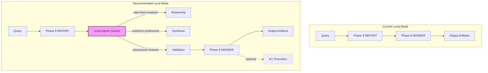
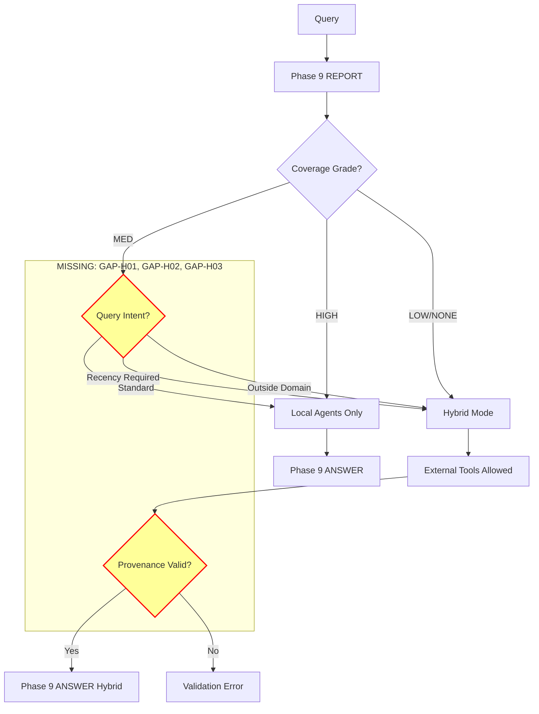
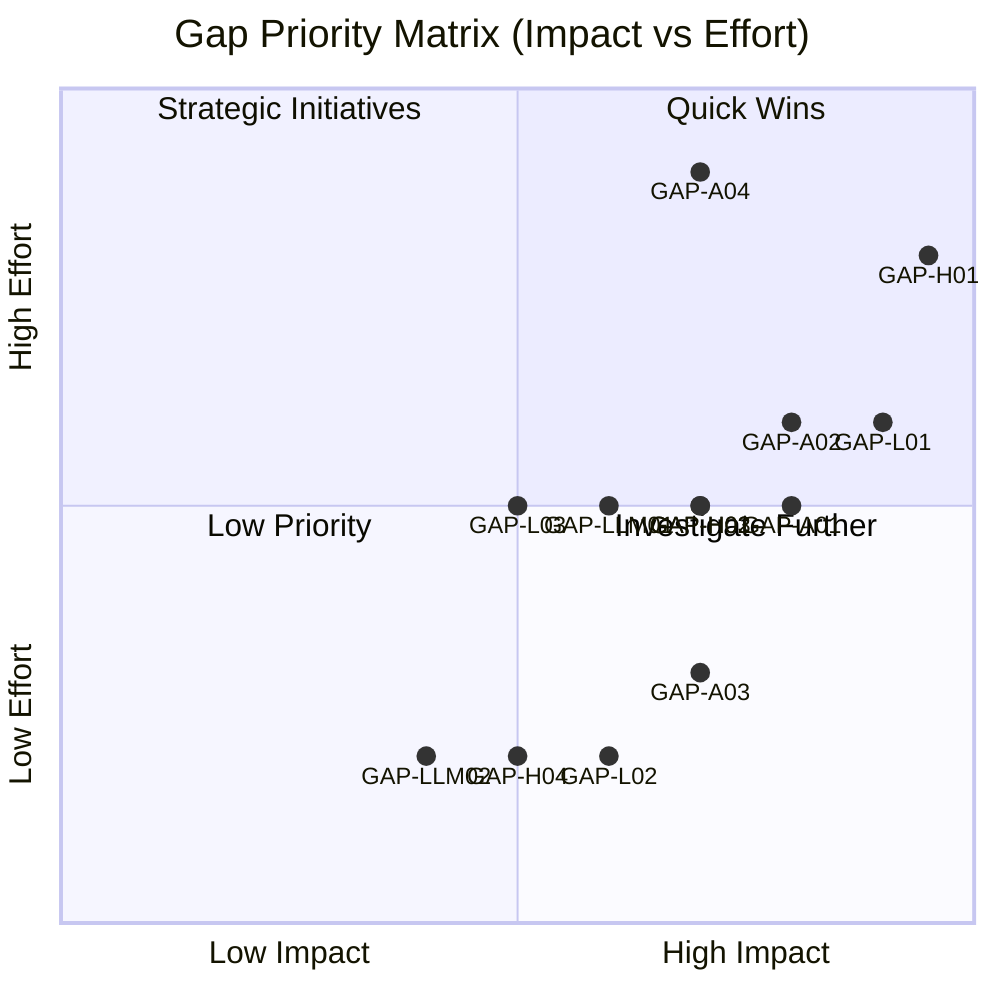

# God-Learn Pipeline Architecture Gap Analysis

**Date**: 2026-01-12
**Analyst**: Gap Analysis Specialist (Phase 1)
**Scope**: Phases 1-10 God-Learn/PhD Pipeline Architecture
**Focus**: Local-only vs Hybrid mode support, Agent integration, LLM usage boundaries

---

## Executive Summary

The God-Learn pipeline (Phases 1-10) is a sophisticated scholarly research system with strong foundational architecture. However, analysis reveals **12 critical gaps** and **8 enhancement opportunities** related to the user requirements:

1. **Local-only mode** (`god-research-local`) - Partially implemented, needs refinement
2. **Hybrid mode** (`god-research-hybrid`) - Implemented but lacks enforcement mechanisms
3. **Agent integration** - 46 agents available but underutilized in local/hybrid modes
4. **LLM usage boundaries** - Reasonably defined but not uniformly enforced

**Overall Health Score: 7/10**

---

## 1. Gap Analysis: Local-Only Mode

### 1.1 Current Implementation Assessment

**Location**: `/home/dalton/projects/claudeflow-testing/.claude/commands/god-research-local.md`

**Current Behavior**:
- Forces `--data-source local`
- Runs Phase 9 REPORT + ANSWER immediately
- Skips the full 46-agent pipeline
- Returns a virtual "agent" pointing to artifacts

**Gap Score: 6/10**

| Dimension | Score | Issue |
|-----------|-------|-------|
| Functionality | 7/10 | Works but bypasses all agents |
| Agent Utilization | 3/10 | Only Phase 9 scripts used; 46 agents ignored |
| Determinism | 9/10 | Fully deterministic, no LLM |
| Corpus Coverage | 8/10 | Good retrieval from local corpus |

### 1.2 Identified Gaps

#### GAP-L01: Zero Agent Utilization in Local Mode (P0 - Critical)

**Current State**: `god-research-local` completely bypasses the 46-agent pipeline, jumping directly to Phase 9 scripts.

**Evidence**:
```markdown
# From god-research-local.md
- Do NOT attempt to run the 46-agent pipeline. Local mode ends after Phase 9.
```

**Impact**:
- Loses all value from specialized agents (literature-mapper, evidence-synthesizer, etc.)
- No cross-document reasoning beyond Phase 7 static edges
- No methodology design, adversarial review, or quality validation

**Recommendation**: Create a **local-agent-subset** that runs key agents WITHOUT external tools:
- `step-back-analyzer` (Phase 1) - local reasoning
- `evidence-synthesizer` (Phase 4) - local synthesis
- `adversarial-reviewer` (Phase 7) - local validation

**Effort**: Medium (2-3 days)

---

#### GAP-L02: No Incremental Knowledge Promotion in Local Mode (P1 - High)

**Current State**: Phase 9 queries existing KUs but cannot promote new ones in local mode.

**Evidence** (from `scripts/interaction/report.py:246-321`):
```python
def surface_knowledge_units(...):
    kus_raw = load_jsonl(knowledge_path)  # READ-ONLY
    # ... scoring and surfacing logic
```

**Impact**: Local mode is purely diagnostic; cannot learn from queries.

**Recommendation**: Add optional `--allow-local-promotion` flag that:
1. Runs synthesis on high-confidence retrievals
2. Promotes to `god-learn/knowledge.jsonl` (append-only)
3. Respects existing Phase 6 invariants (immutable KUs)

**Effort**: Low (1 day)

---

#### GAP-L03: Missing Local-Only Reasoning Graph Extension (P2 - Medium)

**Current State**: Phase 7 reasoning edges are static; local mode cannot extend them.

**Evidence** (from `scripts/reason/` directory existence):
```bash
ls scripts/reason/
# Phase 7 scripts exist but are locked for local mode
```

**Impact**: Cross-document relationships discovered in local mode are lost.

**Recommendation**: Create `scripts/interaction/local_reason.py`:
- Operates on Phase 9 report output
- Computes transient reasoning edges (session-scoped, not persisted)
- Does not mutate `god-reason/reasoning.jsonl`

**Effort**: Medium (2 days)

---

### 1.3 Local Mode Architecture Diagram



---

## 2. Gap Analysis: Hybrid Mode

### 2.1 Current Implementation Assessment

**Location**: `/home/dalton/projects/claudeflow-testing/.claude/commands/god-research-hybrid.md`

**Current Behavior**:
- Always runs Phase 9 REPORT first (local corpus)
- Uses coverage grade to decide external supplementation
- Requires explicit labeling and separation of provenance

**Gap Score: 7/10**

| Dimension | Score | Issue |
|-----------|-------|-------|
| Policy Clarity | 9/10 | Well-documented hybrid rules |
| Enforcement | 5/10 | Relies on agent compliance, not hard gates |
| Provenance Separation | 7/10 | Schema supports it, but not validated |
| Fallback Logic | 6/10 | Two-axis coverage logic exists but incomplete |

### 2.2 Identified Gaps

#### GAP-H01: No Programmatic External Tool Gate (P0 - Critical)

**Current State**: Hybrid mode relies on prompt instructions to prevent external tool use.

**Evidence** (from `phd-cli.ts:353-389`):
```typescript
function buildHybridPolicyBlock(args: {...}): string {
  // Returns STRING instructions, not enforcement
  const allowExternalText = allowExternal
    ? "External tools are permitted because local coverage is LOW/NONE."
    : "External tools are NOT permitted unless you can justify...";
}
```

**Impact**: Agents CAN use external tools even when coverage is HIGH (prompt is advisory only).

**Recommendation**: Implement **tool permission filtering** in session state:
```typescript
interface SessionState {
  // ...existing fields
  allowedTools: ToolPermissions;
}

type ToolPermissions = {
  webSearch: boolean;
  webFetch: boolean;
  perplexity: boolean;
};

// In agent spawning logic:
if (!session.allowedTools.webSearch) {
  // Disable tool at runtime, not just in prompt
}
```

**Effort**: High (3-4 days) - requires integration with claude-flow tool filtering

---

#### GAP-H02: No External Provenance Validation (P1 - High)

**Current State**: External provenance labeling is required by policy but not validated.

**Evidence** (from `phase_9_README_updated.md:329-381`):
```markdown
Outputs must clearly separate:
- Local provenance (chunk_id, knowledge_unit_id, reasoning_edge_id)
- External provenance (URL, Source name, Reason for supplementation)
```

**Impact**: Mixed provenance can slip through without detection.

**Recommendation**: Add `validate_provenance.py` script:
```python
def validate_hybrid_output(answer_json: dict) -> ValidationResult:
    """
    Ensures:
    1. All claims reference either local OR external provenance (not both)
    2. External claims have URL + source + justification
    3. No unlabeled external content
    """
```

**Effort**: Medium (2 days)

---

#### GAP-H03: Incomplete Two-Axis Coverage Logic (P1 - High)

**Current State**: Coverage grade only considers retrieval statistics, not query intent.

**Evidence** (from `report.py:439-447`):
```python
if retr_n == 0:
    grade = "NONE"
elif retr_n >= 8 and ku_n >= 3:
    grade = "HIGH"
elif retr_n >= 3 and ku_n >= 1:
    grade = "MED"
else:
    grade = "LOW"
```

**Issue**: This is purely quantitative. Per the README:
> coverage_grade: HIGH does not forbid external use
> External supplementation may still be justified by:
> - Recency intent (e.g., "2025", "current", "latest")
> - Outside-corpus domains (e.g., VR rhetoric not yet ingested)

**Impact**: Recency and domain-intent analysis is not implemented.

**Recommendation**: Add query intent analyzer:
```python
def analyze_query_intent(query: str) -> QueryIntent:
    """
    Returns:
    - recency_required: bool (detected temporal markers)
    - outside_corpus_domains: List[str] (detected domains not in corpus)
    - external_supplementation_justified: bool
    """
```

**Effort**: Medium (2 days)

---

#### GAP-H04: No Hybrid Session Audit Trail (P2 - Medium)

**Current State**: No persistent record of when/why external tools were used.

**Evidence**: Session manager stores completion state but not tool usage:
```typescript
// session-manager.ts stores:
interface PipelineSession {
  sessionId: string;
  completedAgents: string[];
  // No tool usage tracking
}
```

**Impact**: Cannot audit compliance with hybrid policy post-hoc.

**Recommendation**: Add tool usage tracking:
```typescript
interface ToolUsageEntry {
  timestamp: string;
  agentKey: string;
  tool: string;
  justification: string;
  coverageGradeAtTime: Phase9CoverageGrade;
}

interface PipelineSession {
  // ...existing
  toolUsageLog: ToolUsageEntry[];
}
```

**Effort**: Low (1 day)

---

### 2.3 Hybrid Mode Flow Diagram



---

## 3. Gap Analysis: Agent Integration

### 3.1 Current Agent Architecture

**Location**: `/home/dalton/projects/claudeflow-testing/.claude/agents/phdresearch/`

**Agent Count**: 46 agents across 7 phases (as per `phd-pipeline-config.ts`)

| Phase | Name | Agents | Currently Used in Local/Hybrid? |
|-------|------|--------|--------------------------------|
| 1 | Foundation | 6 | No |
| 2 | Discovery | 5 | No |
| 3 | Architecture | 4 | No |
| 4 | Synthesis | 5 | No |
| 5 | Design | 10 | No |
| 6 | Writing | 6 | No |
| 7 | Validation | 10 | No |

**Gap Score: 4/10** (agents available but not integrated with local/hybrid modes)

### 3.2 Identified Gaps

#### GAP-A01: Agents Not Classified by External Tool Dependency (P0 - Critical)

**Current State**: No metadata distinguishing agents that need external tools from those that don't.

**Evidence** (from `phd-pipeline-config.ts`):
```typescript
// Agent config has no tool dependency field
export const PHD_AGENTS: AgentConfig[] = [
  { key: 'step-back-analyzer', phase: 1, ... },
  // No: requiresExternalTools: boolean
]
```

**Impact**: Cannot selectively run agents in local mode.

**Recommendation**: Add tool dependency classification:
```typescript
interface AgentConfig {
  key: string;
  phase: number;
  displayName: string;
  file: string;
  // NEW FIELDS:
  requiresExternalTools: boolean;
  externalToolsUsed?: ('webSearch' | 'webFetch' | 'perplexity')[];
  canRunLocalOnly: boolean;
}
```

**Suggested Classification**:
| Agent | Can Run Local-Only? | External Tools Used |
|-------|---------------------|---------------------|
| step-back-analyzer | YES | None |
| literature-mapper | NO | webSearch |
| evidence-synthesizer | YES | None |
| adversarial-reviewer | YES | None |
| context-tier-manager | PARTIAL | webFetch (optional) |

**Effort**: Medium (2 days to classify all 46 agents)

---

#### GAP-A02: No Agent Selection Strategy for Local Mode (P1 - High)

**Current State**: Local mode runs 0 agents (Phase 9 scripts only).

**Impact**: Massive underutilization of agent capabilities.

**Recommendation**: Implement **local agent chain**:
```typescript
const LOCAL_MODE_AGENTS = [
  'step-back-analyzer',      // Foundation reasoning
  'self-ask-decomposer',     // Query decomposition
  'evidence-synthesizer',    // Local synthesis
  'theoretical-framework-analyst', // Framework analysis
  'adversarial-reviewer',    // Quality check
  'quality-assurance-checker', // Final validation
];

// In phd-cli.ts local mode:
if (dataSourceMode === 'local') {
  agents = PHD_AGENTS.filter(a => LOCAL_MODE_AGENTS.includes(a.key));
}
```

**Effort**: Medium (2-3 days)

---

#### GAP-A03: Agents Cannot Access Phase 9 REPORT (P1 - High)

**Current State**: Agents in Phases 1-7 do not receive Phase 9 coverage data.

**Evidence** (from `phd-cli.ts:551-566`):
```typescript
function buildYourTaskSection(agent, session, agentFileContent): string {
  // No Phase 9 report injection
  return `## YOUR TASK\n${agentFileContent}\n...`;
}
```

**Impact**: Agents cannot make informed decisions about local vs external sources.

**Recommendation**: Inject Phase 9 report into agent context for hybrid mode:
```typescript
function buildYourTaskSection(agent, session, agentFileContent, phase9Report?): string {
  let section = `## YOUR TASK\n${agentFileContent}\n`;

  if (phase9Report && session.dataSourceMode === 'hybrid') {
    section += `\n## LOCAL CORPUS COVERAGE\n`;
    section += `Coverage Grade: ${phase9Report.coverage_summary.coverage_grade}\n`;
    section += `Retrieved Chunks: ${phase9Report.retrieval.stats.n_returned}\n`;
    section += `Knowledge Units: ${phase9Report.knowledge_units.hits.length}\n`;
  }

  return section;
}
```

**Effort**: Low (1 day)

---

#### GAP-A04: No Swarm Integration for Research (P2 - Medium)

**Current State**: Research pipeline uses sequential agent execution, not swarm orchestration.

**Available but Unused**:
- `/home/dalton/projects/claudeflow-testing/.claude/skills/swarm-orchestration/`
- `mcp__claude-flow_latest__swarm_*` tools
- `mcp__ruv-swarm__*` tools

**Impact**: Research tasks that could parallelize (e.g., multi-source evidence gathering) run sequentially.

**Recommendation**: Create `god-research-swarm` mode:
```markdown
# god-research-swarm

Uses swarm orchestration to parallelize:
- Phase 2 (Discovery) - parallel literature search
- Phase 4 (Synthesis) - parallel evidence analysis
- Phase 7 (Validation) - parallel review processes
```

**Effort**: High (5+ days)

---

## 4. Gap Analysis: LLM Usage Boundaries

### 4.1 Current LLM Boundary Definition

| Component | LLM Usage | Correctly Bounded? |
|-----------|-----------|-------------------|
| Phase 1-3 (Ingestion) | None | YES - Locked |
| Phase 4 (Retrieval) | None | YES - Locked |
| Phase 5 (Highlights) | None | YES - Locked |
| Phase 6 (KU Promotion) | None | YES - Locked |
| Phase 7 (Reasoning) | None | YES - Locked |
| Phase 8A (Assembly) | None | YES - Locked |
| Phase 8B (Style) | LLM for style only | PARTIALLY - needs enforcement |
| Phase 9A (REPORT) | None | YES - Locked |
| Phase 9B (ANSWER) | None | YES - Locked |
| Phase 9C (Synthesis) | LLM for claims | YES - grounding enforced |
| Phase 10 (Presentation) | LLM optional | YES - non-authoritative |

**Gap Score: 8/10** (well-defined, minor enforcement gaps)

### 4.2 Identified Gaps

#### GAP-LLM01: Phase 8B Style Render Not Strictly Bounded (P1 - High)

**Current State**: Phase 8B allows LLM for "surface-level rewrite only" but this is not validated.

**Evidence** (from pipeline README):
```markdown
Phase 8B - Style Render Pass
- Apply trained GodAgent academic style
- Surface-level rewrite only
- Citations, structure, and provenance preserved verbatim
```

**Impact**: Style pass could inadvertently modify content, not just style.

**Recommendation**: Add Phase 8B output validator:
```python
def validate_style_pass(draft_md: str, styled_md: str) -> ValidationResult:
    """
    Ensures:
    1. All citations in draft exist in styled (no loss)
    2. Section headings preserved
    3. Factual claims unchanged (semantic similarity > 0.95)
    4. Only stylistic elements modified (sentence structure, word choice)
    """
```

**Effort**: Medium (2 days)

---

#### GAP-LLM02: No LLM Call Logging (P2 - Medium)

**Current State**: LLM invocations are not centrally logged.

**Evidence** (from `synthesize.py:368-399`):
```python
def synthesize_claims(...):
    r = run_llm_cmd(prompt, llm_cmd=llm_cmd, timeout_s=int(timeout_s))
    # No logging of the call or response
```

**Impact**: Cannot audit LLM usage for compliance or debugging.

**Recommendation**: Add LLM call logger:
```python
def log_llm_call(
    phase: str,
    purpose: str,
    prompt_hash: str,
    response_hash: str,
    tokens_used: int,
    timestamp: str
):
    """Append to llm_calls.jsonl for audit trail."""
```

**Effort**: Low (1 day)

---

## 5. Priority Matrix



---

## 6. Recommended Implementation Order

### Phase 1: Quick Wins (Week 1)
1. **GAP-L02**: Add optional local KU promotion flag
2. **GAP-H04**: Add tool usage logging to session
3. **GAP-LLM02**: Add LLM call logging
4. **GAP-A03**: Inject Phase 9 report into agent context

### Phase 2: Core Improvements (Week 2-3)
5. **GAP-A01**: Classify all 46 agents by tool dependency
6. **GAP-A02**: Implement local agent chain
7. **GAP-H02**: Add provenance validation script
8. **GAP-H03**: Implement query intent analyzer

### Phase 3: Strategic Initiatives (Week 4+)
9. **GAP-L01**: Create local-agent-subset mode
10. **GAP-H01**: Implement programmatic tool gate
11. **GAP-LLM01**: Add Phase 8B style validation
12. **GAP-A04**: Create swarm-integrated research mode

---

## 7. Summary of User Requirements vs Current State

| User Requirement | Current State | Gap Level | Priority |
|------------------|---------------|-----------|----------|
| Use all available agents | 46 agents exist but unused in local/hybrid | HIGH | P0 |
| Local corpus ONLY in some cases | Implemented but bypasses agents | MEDIUM | P1 |
| Options to look externally if needed | Hybrid mode exists but lacks enforcement | MEDIUM | P0 |
| LLMs for style, reasoning, argumentation | Well-bounded in Phases 8-10 | LOW | P2 |

---

## 8. Conclusion

The God-Learn pipeline has a solid architectural foundation with clear separation between:
- **Knowledge ingestion** (Phases 1-3) - locked, deterministic
- **Knowledge retrieval** (Phases 4-5) - locked, deterministic
- **Knowledge promotion** (Phases 6-7) - locked, append-only
- **Epistemic boundary** (Phase 9) - locked, read-only
- **Presentation** (Phase 10) - non-authoritative, LLM-optional

The primary gaps center on:
1. **Agent underutilization** in local/hybrid modes
2. **Lack of programmatic enforcement** for hybrid tool permissions
3. **Missing validation** for provenance separation

Addressing these gaps would transform the system from "Phase 9-only local mode" to a fully agent-integrated scholarly research pipeline that respects the epistemic boundary between local and external knowledge.

---

**Document Version**: 1.0
**Next Review**: After implementation of Phase 1 quick wins
