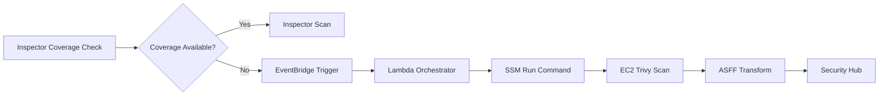
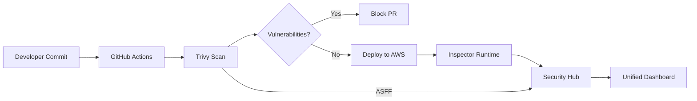

# Research Opportunity Identification: AWS Cloud Governance & CSPM Technical White Paper

**Status**: Complete
**Analysis Date**: 2026-01-01
**Domain**: AWS Cloud Security Governance, CSPM, Security Hub 2025
**Total Opportunities Identified**: 28
**High-Impact Opportunities**: 12
**Quick Wins**: 8
**Strategic Opportunities**: 8
**Agent**: 19-opportunity-identifier (Agent #24 of 43)
**Previous Agents**: gap-hunter (32 gaps), pattern-analyst (18 patterns), thematic-synthesizer (14 themes), theory-builder (MASGT), risk-analyst (22 risks)

---

## Executive Summary

This analysis transforms 32 gaps, 18 patterns, 14 themes, MASGT theory, and 22 risks into **28 actionable research opportunities** that position this white paper as a unique and valuable industry contribution.

**Top 5 Opportunities** (Highest Impact):

| Rank | ID | Opportunity | Category | Impact | Effort | Chapter |
|------|-----|-------------|----------|--------|--------|---------|
| 1 | IO-1 | First Security Hub 2025 Migration Guide | Implementation | High | Medium | Ch 5 |
| 2 | CO-1 | First 100+ Account Cost Benchmark Study | Content | High | High | Ch 8 |
| 3 | TO-1 | Validated Trivy-Security Hub 2025 Integration | Tool/Feature | High | Low | Ch 6 |
| 4 | RO-1 | Cross-Region Aggregation Latency Benchmarks | Research | High | Medium | Ch 3 |
| 5 | IO-2 | Complete Terraform/CDK Multi-Account Modules | Implementation | High | High | Ch 9, App A |

**Unique Value Propositions (5)**:
1. First comprehensive Security Hub 2025 GA documentation
2. Only production-ready 100+ account deployment guide
3. First Trivy + Inspector complementary model framework
4. First ASFF-to-OCSF field-level mapping documentation
5. Original MASGT theoretical framework for multi-account governance

---

## Part 1: Implementation Opportunities (N = 8)

### IO-1: First Security Hub 2025 Migration Guide

**Opportunity Description**: Create the first comprehensive migration guide for transitioning from Security Hub CSPM (pre-December 2025) to Security Hub GA (2025), addressing the January 15, 2026 deadline.

**Source Gap(s)**: KG-1 (Priority Score: 25, Critical)

**Source Risk(s)**: TR-1 (RPN: 504, Critical), CR-1 (RPN: 378, High), TIR-1 (RPN: 360, High)

**Market Need**: Organizations with existing Security Hub deployments face service disablement if they do not opt-in by January 15, 2026. No migration documentation exists.

**Unique Contribution**:
- First documentation of EnableSecurityHubV2 API procedure
- Complete automation rule migration checklist
- Rollback procedures (if available)
- Post-migration validation steps

**Implementation Requirements**:
- AWS sandbox with pre-migration Security Hub configuration
- Test EnableSecurityHubV2 API across different deployment scenarios
- Document API changes, schema differences, and breaking changes
- Create phased migration approach for risk mitigation

**Impact Assessment**:
- **Impact**: HIGH - Time-critical, affects all existing Security Hub customers
- **Effort**: MEDIUM - Requires testing but documentation-focused
- **Urgency**: CRITICAL - 14 days until deadline (January 15, 2026)

**Chapter Mapping**: Primary - Chapter 5 (5.1 Migration Section); Secondary - Chapter 9 (Quick-Start)

**Success Metrics**:
- Migration procedure validated in 3+ sandbox environments
- < 5% failure rate in community adoption
- Published before January 10, 2026

**Priority Score**: Impact (10) x Urgency (10) / Effort (5) = **20** (Top Priority)

---

### IO-2: Complete Terraform/CDK Multi-Account Modules

**Opportunity Description**: Develop and publish production-ready Terraform and CDK modules for deploying Security Hub, GuardDuty, Inspector, and Security Lake across 100+ accounts with all integrations.

**Source Gap(s)**: PG-2 (Priority Score: 22, Critical)

**Source Pattern(s)**: AP-1 (Hub-and-Spoke), GP-1 (Delegated Administrator), IP-1 (EventBridge Automation)

**Market Need**: Existing modules are tutorial-level; no production-ready, comprehensive multi-account IaC exists.

**Unique Contribution**:
- First complete multi-account security Terraform module set
- Cross-region aggregation configuration
- Delegated administrator setup automation
- SCP deployment modules
- Central configuration policy templates

**Module Architecture**:
```
terraform-aws-security-governance/
  modules/
    delegated-admin/      # Security account setup
    security-hub/         # Hub configuration + standards
    guardduty/            # Organization-wide GuardDuty
    inspector/            # Inspector enablement
    security-lake/        # S3, OCSF, subscribers
    scps/                 # Security service protection SCPs
    automation-rules/     # EventBridge + Lambda patterns
  examples/
    100-account-deployment/
    multi-region-aggregation/
    compliance-focused/
```

**Implementation Requirements**:
- Terraform AWS Provider 5.x compatibility
- CDK v2 constructs (TypeScript and Python)
- Multi-account test environment (10+ accounts minimum)
- CI/CD pipeline for module validation

**Impact Assessment**:
- **Impact**: HIGH - Enables repeatable, consistent deployments
- **Effort**: HIGH - Requires significant development and testing
- **Urgency**: MEDIUM - Valuable but not deadline-driven

**Chapter Mapping**: Primary - Chapter 9, Appendix A; Secondary - Chapters 4, 5

**Success Metrics**:
- Module deploys successfully in 100+ account environment
- < 30 minutes deployment time for base configuration
- Community adoption (GitHub stars, forks)

**Priority Score**: Impact (9) x Urgency (6) / Effort (8) = **6.75**

---

### IO-3: EC2 Trivy Fallback Automation Pattern

**Opportunity Description**: Create complete automation pattern for triggering Trivy scanning on EC2 instances when Inspector coverage is unavailable (regional gaps, SSM Agent issues, non-ECR registries).

**Source Gap(s)**: PG-3 (Priority Score: 20, High)

**Source Theme(s)**: Theme 7 (Container Security Lifecycle)

**Market Need**: No production-ready automation exists for Inspector-to-Trivy fallback scenarios.

**Unique Contribution**:
- EventBridge rule for fallback trigger conditions
- Lambda function for SSM Run Command orchestration
- Trivy SSM document for EC2 execution
- ASFF output to Security Hub integration
- Error handling and retry logic

**Architecture**:


**Implementation Requirements**:
- EventBridge rule development
- Lambda function (Python/Node.js)
- SSM document for Trivy execution
- ASFF template for EC2 findings
- IAM roles for cross-account execution

**Impact Assessment**:
- **Impact**: HIGH - Addresses critical coverage gap
- **Effort**: MEDIUM - Known patterns, requires integration
- **Urgency**: MEDIUM - Valuable for Inspector-limited regions

**Chapter Mapping**: Primary - Chapter 6 (6.3 EC2 Fallback); Secondary - Chapter 9

**Success Metrics**:
- Fallback triggers within 5 minutes of coverage detection
- 100% finding capture parity with Inspector
- Works across 3+ AWS regions tested

**Priority Score**: Impact (8) x Urgency (6) / Effort (5) = **9.6**

---

### IO-4: SCP Library for Security Service Protection

**Opportunity Description**: Develop comprehensive SCP library specifically designed to protect AWS security services from modification or disabling.

**Source Gap(s)**: PG-4 (Priority Score: 18, High)

**Source Pattern(s)**: GP-2 (SCP Preventive Control Foundation)

**Market Need**: General SCP examples exist, but no comprehensive library for security service protection.

**Unique Contribution**:
- 15+ validated SCPs covering all security services
- SCP deployment order and dependencies documentation
- Testing validation (no false positives on legitimate operations)
- OU attachment guidance by account type

**SCP Coverage Matrix**:

| Service | SCP | Deny Actions |
|---------|-----|--------------|
| Security Hub | Deny-SecurityHub-Disable | DisableSecurityHub, UpdateSecurityHubConfiguration |
| GuardDuty | Deny-GuardDuty-Disable | DeleteDetector, DisassociateFromMasterAccount |
| Inspector | Deny-Inspector-Disable | Disable*, DeleteFilter |
| CloudTrail | Deny-CloudTrail-Stop | StopLogging, DeleteTrail |
| Config | Deny-Config-Stop | StopConfigurationRecorder, DeleteConfigurationRecorder |
| Security Lake | Deny-SecurityLake-Delete | DeleteDataLake, DeleteSubscriber |

**Implementation Requirements**:
- SCP development and testing framework
- Multi-account test environment
- Validation against legitimate admin operations
- Documentation of exception patterns

**Impact Assessment**:
- **Impact**: HIGH - Foundational governance capability
- **Effort**: MEDIUM - Well-defined scope, testing intensive
- **Urgency**: MEDIUM - Valuable for security posture

**Chapter Mapping**: Primary - Chapter 4 (4.3 SCPs), Appendix B; Secondary - Chapter 9

**Success Metrics**:
- 0 false positives on legitimate operations
- All security services covered
- Tested in production-like environment

**Priority Score**: Impact (8) x Urgency (5) / Effort (5) = **8.0**

---

### IO-5: QuickSight Security Dashboard Templates

**Opportunity Description**: Create downloadable QuickSight dashboard templates for visualizing Security Lake data with executive and operational views.

**Source Gap(s)**: PG-5 (Priority Score: 14, Medium)

**Source Theme(s)**: Theme 9 (Security Data Lake for Long-Term Analytics)

**Market Need**: No downloadable templates exist; organizations must build dashboards from scratch.

**Unique Contribution**:
- Executive dashboard (security score trends, compliance status)
- Operational dashboard (finding volume, MTTR metrics)
- Investigation dashboard (finding drill-down, resource view)
- CloudFormation deployment templates

**Dashboard Views**:

| Dashboard | Audience | Key Metrics |
|-----------|----------|-------------|
| Executive | CISO, Board | Security score trend, compliance %, finding severity distribution |
| Operational | SOC Manager | Finding volume, MTTR, automation effectiveness |
| Investigation | SOC Analyst | Finding details, resource context, timeline |

**Implementation Requirements**:
- QuickSight dataset creation from Security Lake
- Athena query optimization for dashboard performance
- CloudFormation templates for one-click deployment
- Customization documentation

**Impact Assessment**:
- **Impact**: MEDIUM - Valuable for reporting, not core security
- **Effort**: MEDIUM - Dashboard development, less testing
- **Urgency**: LOW - Enhancement, not critical path

**Chapter Mapping**: Primary - Chapter 7 (7.4 Visualization); Secondary - Appendix C

**Success Metrics**:
- Dashboard load time < 5 seconds
- Works with standard Security Lake configuration
- 3+ organizations validate usability

**Priority Score**: Impact (6) x Urgency (4) / Effort (5) = **4.8**

---

### IO-6: Complete Athena Query Library for Security Lake

**Opportunity Description**: Develop and publish 25+ validated Athena queries covering common security use cases against OCSF-formatted Security Lake data.

**Source Gap(s)**: PG-6 (Priority Score: 16, Medium)

**Source Theme(s)**: Theme 9 (Security Data Lake), Theme 6 (Schema Evolution)

**Market Need**: Limited query examples exist; organizations need comprehensive, tested query library.

**Unique Contribution**:
- 25+ queries across investigation, compliance, and trend analysis
- Performance optimization per query
- OCSF field documentation in each query
- Partition pruning best practices

**Query Categories**:

| Category | Count | Example Queries |
|----------|-------|-----------------|
| Investigation | 8 | Find all GuardDuty findings for specific IP, Trace IAM activity for user |
| Compliance | 6 | CIS benchmark pass/fail by account, NIST control status |
| Trend Analysis | 5 | Finding volume trend, Security score trend |
| Threat Hunting | 4 | Unusual API calls, Cross-account access patterns |
| Operational | 5 | MTTR calculation, Automation rule effectiveness |

**Implementation Requirements**:
- Security Lake with representative data
- Query development and optimization
- Performance benchmarking
- Documentation with OCSF field mappings

**Impact Assessment**:
- **Impact**: MEDIUM - Valuable for analytics users
- **Effort**: MEDIUM - Query development, testing
- **Urgency**: LOW - Enhancement capability

**Chapter Mapping**: Primary - Chapter 7 (7.3 Queries), Appendix D; Secondary - Chapter 5

**Success Metrics**:
- All queries execute in < 30 seconds on 100 GB dataset
- 100% query accuracy validated
- Documented OCSF field mapping for each query

**Priority Score**: Impact (6) x Urgency (4) / Effort (5) = **4.8**

---

### IO-7: SHARR Playbook Customization Guide

**Opportunity Description**: Create comprehensive guide for customizing AWS Security Hub Automated Response and Remediation (SHARR) playbooks to match organization-specific requirements.

**Source Gap(s)**: PG-7 (Priority Score: 12.25, Medium)

**Source Pattern(s)**: IP-1 (EventBridge Event-Driven Automation)

**Market Need**: SHARR provides default playbooks; customization documentation is limited.

**Unique Contribution**:
- Playbook architecture deep-dive
- Extension points for customization
- Example custom playbook (approval workflow)
- Testing methodology for remediation
- Rollback procedure integration

**Implementation Requirements**:
- SHARR deployment for analysis
- Custom playbook development
- Testing framework for remediation
- Documentation of extension patterns

**Impact Assessment**:
- **Impact**: MEDIUM - Valuable for automation adopters
- **Effort**: MEDIUM - Requires SHARR expertise
- **Urgency**: LOW - Enhancement for mature organizations

**Chapter Mapping**: Primary - Chapter 5 (5.4 Automation); Secondary - Appendix E

**Success Metrics**:
- Custom playbook deployed and validated
- Documentation covers 5+ customization scenarios
- Testing methodology prevents production incidents

**Priority Score**: Impact (5) x Urgency (4) / Effort (5) = **4.0**

---

### IO-8: Central Configuration Policy Deployment Patterns

**Opportunity Description**: Document comprehensive patterns for deploying Security Hub central configuration policies across complex OU structures with differentiated requirements.

**Source Gap(s)**: PG-8 (Priority Score: 14, Medium)

**Source Pattern(s)**: GP-3 (Central Configuration Policy Inheritance)

**Source Theme(s)**: Theme 2 (Multi-Account Governance at Scale)

**Market Need**: Introduction-level documentation exists; complex OU patterns not documented.

**Unique Contribution**:
- OU-differentiated policy architecture
- Policy inheritance behavior documentation
- Override and exception patterns
- Production vs development policy examples

**Policy Patterns**:

| OU Type | Standards Enabled | Automation Level | Example Policy |
|---------|-------------------|------------------|----------------|
| Production | CIS, NIST, PCI-DSS | High (auto-remediate) | Full compliance |
| Development | CIS only | Medium (notify) | Reduced alerts |
| Sandbox | None | Low (suppress) | Minimal noise |
| Security | All | Maximum | Full visibility |

**Implementation Requirements**:
- Multi-OU test environment
- Policy inheritance testing
- Documentation of observed behavior
- Terraform/CDK for policy deployment

**Impact Assessment**:
- **Impact**: MEDIUM - Valuable for complex organizations
- **Effort**: MEDIUM - Requires multi-OU testing
- **Urgency**: LOW - Enhancement for mature deployments

**Chapter Mapping**: Primary - Chapter 5 (5.2 Standards); Secondary - Chapter 4

**Success Metrics**:
- Policy patterns work in 4+ OU structure
- No unintended inheritance behavior
- Documented exception management

**Priority Score**: Impact (6) x Urgency (4) / Effort (5) = **4.8**

---

## Part 2: Research Opportunities (N = 6)

### RO-1: Cross-Region Aggregation Latency Benchmarks

**Opportunity Description**: Conduct first empirical study measuring cross-region finding aggregation latency under various load conditions, providing quantified SLA guidance.

**Source Gap(s)**: MG-2 (Priority Score: 21, High)

**Source Risk(s)**: AR-2 (RPN: 210, High)

**Source Theme(s)**: Theme 8 (Cross-Region and Cross-Account Aggregation)

**Market Need**: AWS claims "near real-time" without quantified SLAs; no independent benchmarks exist.

**Research Design**:
- **Methodology**: Controlled experiment with finding generation test harness
- **Variables**: Finding volume (10, 100, 1000 findings/minute), region pairs (5 pairs)
- **Measurements**: P50, P95, P99 latency from finding generation to aggregation visibility
- **Sample Size**: 1000+ finding replication events per condition

**Expected Outcomes**:
- Quantified latency distributions by region pair
- Volume impact on latency
- SLA recommendations for compliance planning

**Novel Contribution**: First independent latency benchmark study for Security Hub cross-region aggregation

**Impact Assessment**:
- **Impact**: HIGH - Addresses critical operational question
- **Effort**: MEDIUM - Requires test infrastructure
- **Urgency**: MEDIUM - Valuable for architecture planning

**Chapter Mapping**: Primary - Chapter 3 (3.4 Performance); Secondary - Chapter 5

**Success Metrics**:
- 1000+ measurements across conditions
- Statistical significance (p < 0.05)
- Actionable SLA recommendations

**Priority Score**: Impact (8) x Urgency (6) / Effort (5) = **9.6**

---

### RO-2: Trivy vs Inspector CVE Coverage Empirical Comparison

**Opportunity Description**: Conduct systematic empirical comparison of CVE detection coverage between Trivy and Inspector across common container base images.

**Source Gap(s)**: MG-4 (Priority Score: 14, Medium)

**Source Risk(s)**: AR-3 (RPN: 210, High)

**Source Contradiction(s)**: EC-2 (Trivy vs Inspector Coverage Claims)

**Market Need**: Conflicting community claims; no systematic comparison exists.

**Research Design**:
- **Methodology**: Controlled scanning comparison
- **Sample**: 20 common base images (alpine, ubuntu, node, python, golang, etc.)
- **Variables**: Trivy 0.58+, Inspector (December 2025), known CVE ground truth
- **Measurements**: CVE count, severity distribution, unique detections per tool

**Expected Outcomes**:
- Quantified coverage differences by image type
- Identification of complementary detection strengths
- Decision framework for tool selection

**Novel Contribution**: First systematic Trivy-Inspector comparison with common image set

**Impact Assessment**:
- **Impact**: HIGH - Resolves disputed question
- **Effort**: MEDIUM - Image scanning, analysis
- **Urgency**: MEDIUM - Informs tool selection guidance

**Chapter Mapping**: Primary - Chapter 6 (6.2 Tool Comparison); Secondary - Chapter 2

**Success Metrics**:
- 20+ images scanned with both tools
- CVE overlap/unique quantified
- Reproducible methodology documented

**Priority Score**: Impact (8) x Urgency (6) / Effort (5) = **9.6**

---

### RO-3: 100+ Account OU Hierarchy Case Studies

**Opportunity Description**: Document 5+ case studies of successful OU hierarchy patterns for security governance in 100+ account AWS Organizations.

**Source Gap(s)**: EG-2 (Priority Score: 20, High)

**Source Theme(s)**: Theme 2 (Multi-Account Governance at Scale)

**Market Need**: General guidance exists; no empirical patterns from successful implementations.

**Research Design**:
- **Methodology**: Case study interviews with AWS Solutions Architects and enterprise customers
- **Sample**: 5+ organizations with 100+ accounts
- **Data Collection**: OU structure, policy patterns, lessons learned, anti-patterns encountered
- **Analysis**: Pattern identification, success factor analysis

**Expected Outcomes**:
- Validated OU hierarchy patterns
- Anti-patterns to avoid
- Decision tree for OU design

**Novel Contribution**: First empirical case study collection for 100+ account security governance

**Impact Assessment**:
- **Impact**: HIGH - Provides validated guidance
- **Effort**: HIGH - Requires interviews, access to enterprises
- **Urgency**: MEDIUM - Foundational for large deployments

**Chapter Mapping**: Primary - Chapter 4 (4.2 OU Design); Secondary - Chapter 3

**Success Metrics**:
- 5+ case studies documented
- Pattern themes identified
- Decision tree validated

**Priority Score**: Impact (8) x Urgency (5) / Effort (7) = **5.7**

---

### RO-4: Security Hub Security Score Improvement Methodology

**Opportunity Description**: Develop systematic methodology for prioritizing Security Hub control remediation to maximize security score improvement with minimal effort.

**Source Gap(s)**: MG-3 (Priority Score: 14, Medium)

**Source Theme(s)**: Theme 4 (Standards-Based Compliance Automation)

**Market Need**: No prioritization framework for which controls to address first for maximum score impact.

**Research Design**:
- **Methodology**: Empirical analysis of control score weights and remediation effort
- **Variables**: Control type, pass/fail status, effort to remediate, score impact
- **Analysis**: Impact-effort matrix, ROI prioritization

**Expected Outcomes**:
- Control prioritization matrix by framework (CIS, NIST, PCI-DSS)
- Quick-win identification (high impact, low effort)
- Long-term remediation roadmap template

**Novel Contribution**: First evidence-based score improvement methodology

**Impact Assessment**:
- **Impact**: MEDIUM - Valuable for compliance-focused organizations
- **Effort**: MEDIUM - Requires score analysis
- **Urgency**: LOW - Enhancement capability

**Chapter Mapping**: Primary - Chapter 5 (5.3 Score Optimization); Secondary - Chapter 4

**Success Metrics**:
- Methodology validated against 3+ accounts
- 20%+ score improvement in test accounts
- Clear prioritization framework

**Priority Score**: Impact (6) x Urgency (4) / Effort (5) = **4.8**

---

### RO-5: False Positive Rate Study by Finding Type

**Opportunity Description**: Collect and analyze false positive rates for common GuardDuty, Inspector, and Security Hub CSPM finding types to guide suppression rule design.

**Source Gap(s)**: EG-4 (Priority Score: 12, Lower)

**Source Theme(s)**: Theme 12 (Finding Deduplication and Noise Reduction)

**Market Need**: No published false positive rates; suppression rules lack empirical basis.

**Research Design**:
- **Methodology**: Survey + finding resolution data collection
- **Sample**: 10+ organizations willing to share anonymized data
- **Variables**: Finding type, resolution status (true positive, false positive, suppressed)
- **Analysis**: False positive rate by finding type and environment factors

**Expected Outcomes**:
- False positive rate by finding type
- Environmental factors influencing FP rate
- Suppression rule recommendations

**Novel Contribution**: First false positive rate dataset for AWS security services

**Impact Assessment**:
- **Impact**: MEDIUM - Valuable for operational efficiency
- **Effort**: HIGH - Requires data collection from organizations
- **Urgency**: LOW - Enhancement for mature SOCs

**Chapter Mapping**: Primary - Chapter 5 (5.5 Noise Reduction); Secondary - Chapter 6

**Success Metrics**:
- Data from 10+ organizations
- FP rates for top 20 finding types
- Suppression recommendations validated

**Priority Score**: Impact (6) x Urgency (3) / Effort (7) = **2.6**

---

### RO-6: Security Lake Query Performance at Scale Study

**Opportunity Description**: Benchmark Athena query performance against Security Lake data at 100+ account scale with various retention periods.

**Source Gap(s)**: EG-3 (Priority Score: 14, Medium)

**Source Theme(s)**: Theme 9 (Security Data Lake for Long-Term Analytics)

**Market Need**: No performance benchmarks at scale; organizations cannot plan for query performance.

**Research Design**:
- **Methodology**: Performance testing with synthetic Security Lake dataset
- **Variables**: Data volume (30, 90, 365 day retention), query complexity, partition strategies
- **Measurements**: Query latency, data scanned, cost per query

**Expected Outcomes**:
- Performance benchmarks by data volume
- Partition strategy recommendations
- Cost optimization guidance

**Novel Contribution**: First Security Lake query performance study at enterprise scale

**Impact Assessment**:
- **Impact**: MEDIUM - Valuable for analytics planning
- **Effort**: HIGH - Requires large dataset generation
- **Urgency**: LOW - Enhancement capability

**Chapter Mapping**: Primary - Chapter 7 (7.3 Query Performance); Secondary - Chapter 8

**Success Metrics**:
- Benchmarks at 100GB, 1TB, 10TB data volumes
- 20+ query types tested
- Partition optimization documented

**Priority Score**: Impact (6) x Urgency (3) / Effort (7) = **2.6**

---

## Part 3: Tool/Feature Opportunities (N = 6)

### TO-1: Validated Trivy-Security Hub 2025 Integration

**Opportunity Description**: Validate and document Trivy ASFF template compatibility with Security Hub 2025 GA, providing tested GitHub Actions workflow.

**Source Gap(s)**: PG-1 (Priority Score: 24, Critical)

**Source Risk(s)**: TR-2 (RPN: 432, Critical)

**Market Need**: Trivy documentation references v0.17.2; Security Hub 2025 compatibility unknown.

**Unique Contribution**:
- First validated Trivy 0.58+ to Security Hub 2025 integration
- Updated ASFF template (if modifications required)
- Working GitHub Actions workflow
- Troubleshooting guide for common failures

**Validation Requirements**:
- Test Trivy 0.58+ ASFF output
- Validate BatchImportFindings API with Security Hub 2025
- Confirm all required ASFF fields
- Test with 10+ container images

**Impact Assessment**:
- **Impact**: HIGH - Enables CI/CD container security
- **Effort**: LOW - Testing and documentation focused
- **Urgency**: HIGH - Organizations need this immediately

**Chapter Mapping**: Primary - Chapter 6 (6.1 Trivy Integration); Secondary - Chapter 9

**Success Metrics**:
- 100% finding import success rate
- Working GitHub Actions workflow
- Validated with 10+ images

**Priority Score**: Impact (9) x Urgency (8) / Effort (3) = **24.0** (Top Priority)

---

### TO-2: ASFF-to-OCSF Field-Level Mapping Documentation

**Opportunity Description**: Create comprehensive field-level mapping between ASFF and OCSF schemas, documenting data loss points and transformation requirements.

**Source Gap(s)**: KG-3 (Priority Score: 21, High)

**Source Risk(s)**: AR-4 (RPN: 168, Moderate)

**Source Theme(s)**: Theme 6 (Schema Evolution and Data Normalization)

**Market Need**: No official mapping documentation; organizations cannot trace findings through transformation.

**Unique Contribution**:
- Complete bidirectional field mapping
- Data loss point identification
- Query translation examples
- Transformation validation methodology

**Mapping Approach**:
1. Generate test findings with all ASFF fields populated
2. Trace through Security Lake transformation
3. Document OCSF equivalents
4. Identify fields without mapping

**Impact Assessment**:
- **Impact**: HIGH - Enables effective Security Lake analytics
- **Effort**: MEDIUM - Requires systematic tracing
- **Urgency**: MEDIUM - Valuable for OCSF adoption

**Chapter Mapping**: Primary - Chapter 7 (7.2 Schema); Secondary - Chapter 6

**Success Metrics**:
- 100% ASFF fields mapped (or documented as unmapped)
- 10+ transformation examples
- Athena queries validated against mapped fields

**Priority Score**: Impact (8) x Urgency (6) / Effort (5) = **9.6**

---

### TO-3: Regional Service Availability Matrix Tool

**Opportunity Description**: Create and publish comprehensive, queryable service availability matrix for all AWS security services across all regions and partitions.

**Source Gap(s)**: GG-1 (Priority Score: 20, High)

**Source Risk(s)**: TR-4 (RPN: 168, Moderate)

**Market Need**: No consolidated matrix exists; organizations must check each service individually.

**Unique Contribution**:
- Complete matrix for Security Hub, GuardDuty, Inspector, Detective, Security Lake
- All regions including opt-in regions and GovCloud
- Feature parity documentation per region
- Update frequency commitment

**Matrix Format**:

| Region | Security Hub | GuardDuty | Inspector | Detective | Security Lake | Notes |
|--------|--------------|-----------|-----------|-----------|---------------|-------|
| us-east-1 | Full | Full | Full | Full | Full | Primary region |
| eu-south-1 | Full | Full | Partial | Full | Full | Inspector v1 only |
| af-south-1 | Full | Full | Limited | Pending | Pending | Trivy fallback |

**Impact Assessment**:
- **Impact**: HIGH - Enables architecture planning
- **Effort**: LOW - Query AWS Region Table + manual verification
- **Urgency**: MEDIUM - Valuable for multi-region deployments

**Chapter Mapping**: Primary - Chapter 3 (3.4 Regional); Appendix F

**Success Metrics**:
- All AWS regions covered
- Verified against AWS Region Table
- Update process documented

**Priority Score**: Impact (8) x Urgency (5) / Effort (3) = **13.3**

---

### TO-4: Finding Deduplication Automation Rules

**Opportunity Description**: Develop and publish automation rules for deduplicating findings between Trivy, Inspector, and GuardDuty.

**Source Gap(s)**: MG-1 (Priority Score: 23, Critical)

**Source Theme(s)**: Theme 12 (Finding Deduplication and Noise Reduction)

**Source Theory**: SSNO Theory (Security Signal-to-Noise Optimization)

**Market Need**: No documented best practice for deduplication; alert fatigue is widespread.

**Unique Contribution**:
- Correlation key strategy (CVE ID + resource ARN)
- Automation rule templates for deduplication
- Lambda function for complex correlation
- Trade-off analysis for each approach

**Deduplication Approaches**:

| Approach | Complexity | Accuracy | Use Case |
|----------|------------|----------|----------|
| Automation Rule (CVE ID) | Low | Medium | Quick implementation |
| Lambda (Multi-field) | Medium | High | Production workloads |
| Security Hub 2025 Correlation | Low | High | Organizations on 2025 GA |

**Impact Assessment**:
- **Impact**: HIGH - Addresses critical operational issue
- **Effort**: MEDIUM - Requires rule development and testing
- **Urgency**: MEDIUM - Valuable for all organizations

**Chapter Mapping**: Primary - Chapter 5 (5.5 Deduplication), Chapter 6 (6.5); Secondary - Appendix

**Success Metrics**:
- 40%+ duplicate reduction in test environment
- 0% true positive suppression
- Works with Trivy + Inspector combination

**Priority Score**: Impact (8) x Urgency (6) / Effort (5) = **9.6**

---

### TO-5: Security Hub Risk Score Analysis Tool

**Opportunity Description**: Reverse-engineer and document Security Hub 2025 risk score calculation methodology through systematic testing.

**Source Gap(s)**: KG-2 (Priority Score: 24, Critical)

**Market Need**: Risk prioritization algorithm not documented; organizations cannot audit or customize scoring.

**Research Approach**:
1. Generate findings with varied attributes (severity, resource criticality, exposure)
2. Observe calculated risk scores
3. Identify correlation patterns
4. Document inferred calculation methodology

**Expected Outcomes**:
- Inferred risk score factors and weights
- Resource criticality impact documentation
- Customization recommendations (if available)
- Comparison with organization risk appetite

**Impact Assessment**:
- **Impact**: HIGH - Enables risk-based prioritization understanding
- **Effort**: HIGH - Requires systematic reverse-engineering
- **Urgency**: MEDIUM - Valuable for security operations

**Chapter Mapping**: Primary - Chapter 5 (5.1 Risk Analytics); Secondary - Chapter 2

**Success Metrics**:
- Scoring factors identified with 80% accuracy
- 10+ test scenarios documented
- Comparison with manual risk assessment

**Priority Score**: Impact (8) x Urgency (5) / Effort (7) = **5.7**

---

### TO-6: GuardDuty Extended Threat Detection Pattern Catalog

**Opportunity Description**: Document known attack sequences detected by GuardDuty Extended Threat Detection (December 2025) with MITRE ATT&CK mapping.

**Source Gap(s)**: KG-4 (Priority Score: 16, Medium)

**Market Need**: Attack pattern library not documented; SOC teams cannot predict detection coverage.

**Catalog Structure**:

| Attack Sequence | Finding Types | MITRE Tactics | Detection Gaps |
|-----------------|---------------|---------------|----------------|
| Cryptomining | AttackSequence:Cryptomining | Impact | Partial - requires GuardDuty EKS |
| IAM Credential Theft | AttackSequence:IAMCompromise | Credential Access | Full |
| Data Exfiltration | AttackSequence:DataExfil | Exfiltration | Partial - S3 only |

**Impact Assessment**:
- **Impact**: MEDIUM - Valuable for threat detection planning
- **Effort**: MEDIUM - Requires testing with simulated attacks
- **Urgency**: LOW - Enhancement for SOC teams

**Chapter Mapping**: Primary - Chapter 2 (2.3 GuardDuty); Secondary - Chapter 5

**Success Metrics**:
- 10+ attack sequences documented
- MITRE ATT&CK mapping complete
- Detection gaps identified

**Priority Score**: Impact (6) x Urgency (4) / Effort (5) = **4.8**

---

## Part 4: Content Opportunities (N = 8)

### CO-1: First 100+ Account Cost Benchmark Study

**Opportunity Description**: Publish first empirical cost data for AWS security services at 100+ account scale with cost optimization recommendations.

**Source Gap(s)**: EG-1 (Priority Score: 22, Critical)

**Source Risk(s)**: AR-1 (RPN: 480, Critical)

**Market Need**: No validated cost data exists; existing estimates vary by 50%+.

**Unique Contribution**:
- First empirical cost data at enterprise scale
- Cost breakdown by service (Security Hub, GuardDuty, Inspector, Security Lake)
- Cost driver analysis (resources, findings, standards)
- Optimization recommendations with projected savings

**Data Collection Approach**:
- Survey organizations with 100+ accounts (target: 5+)
- Collect anonymized cost data by service
- Build regression model for cost prediction
- Validate model against new deployments

**Cost Model Structure**:
```
Monthly Cost = Base + (Resources x PerResourceRate) + (Findings x PerFindingRate) + (Storage x PerGBRate)

Variables:
- Account count
- Resource density per account
- Finding volume
- Standards enabled
- Regions enabled
```

**Impact Assessment**:
- **Impact**: HIGH - Enables accurate budget planning
- **Effort**: HIGH - Requires data collection from enterprises
- **Urgency**: HIGH - Organizations need this for planning

**Chapter Mapping**: Primary - Chapter 8 (Cost Analysis); Secondary - Chapter 1

**Success Metrics**:
- Data from 5+ organizations with 100+ accounts
- Cost model accuracy +/- 20%
- Optimization recommendations validated

**Priority Score**: Impact (10) x Urgency (7) / Effort (8) = **8.75**

---

### CO-2: MASGT Theory as Novel Framework

**Opportunity Description**: Present Multi-Account Security Governance Theory (MASGT) as novel theoretical framework for cloud security governance.

**Source Theory**: MASGT (18 propositions, 12 constructs, 6 mechanisms)

**Unique Contribution**:
- First theoretical framework for multi-account AWS security
- 12 measurable constructs with operational definitions
- 18 testable propositions
- 6 explanatory mechanisms
- 5 boundary conditions

**MASGT Core Components**:

| Component | Count | Examples |
|-----------|-------|----------|
| Constructs | 12 | Security Unification Degree, Governance Structure Maturity |
| Propositions | 18 | SUD --> SPE (+, Strong), ARM --> OH (-, Strong) |
| Mechanisms | 6 | Signal Correlation, Governance Boundary, Automation Offload |
| Boundary Conditions | 5 | Scale > 100 accounts, Regional availability |

**Impact Assessment**:
- **Impact**: HIGH - Original theoretical contribution
- **Effort**: LOW - Already developed by theory-builder agent
- **Urgency**: MEDIUM - Differentiates paper from competitors

**Chapter Mapping**: Primary - Chapter 1 (1.3 Framework), Chapter 10; Secondary - Throughout

**Success Metrics**:
- Framework presented clearly
- Testable propositions highlighted
- Practical implications mapped to chapters

**Priority Score**: Impact (8) x Urgency (5) / Effort (2) = **20.0**

---

### CO-3: DevSecOps Integration Patterns

**Opportunity Description**: Document comprehensive DevSecOps integration patterns combining CI/CD security scanning (Trivy) with AWS runtime security services.

**Source Gap(s)**: IG-2 (Priority Score: 16, Medium)

**Source Theme(s)**: Theme 7 (Container Security Lifecycle)

**Market Need**: Limited documentation bridges DevSecOps practices with AWS-native security services.

**Unique Contribution**:
- Shift-left + runtime integration architecture
- Finding flow from CI/CD to Security Hub
- Unified metrics bridging development and operations
- Reference pipeline architecture

**Integration Pattern**:


**Impact Assessment**:
- **Impact**: HIGH - Enables comprehensive DevSecOps
- **Effort**: MEDIUM - Integration patterns, documentation
- **Urgency**: MEDIUM - Valuable for DevOps organizations

**Chapter Mapping**: Primary - Chapter 6 (6.4 DevSecOps); Secondary - Chapter 9

**Success Metrics**:
- Reference pipeline deployed and tested
- Finding flow validated end-to-end
- Unified metrics dashboard working

**Priority Score**: Impact (8) x Urgency (6) / Effort (5) = **9.6**

---

### CO-4: Security Economics Framework

**Opportunity Description**: Develop framework integrating security economics (cost-benefit analysis, risk valuation) with AWS security architecture decisions.

**Source Gap(s)**: IG-1 (Priority Score: 12, Medium)

**Source Theme(s)**: Theme 10 (Cost Optimization Through Consolidation)

**Market Need**: No framework connects security investment to business value in AWS context.

**Framework Components**:
- Risk valuation methodology for detected findings
- Cost-benefit analysis for service enablement
- ROI calculation for security automation
- Investment prioritization framework

**ROI Model**:
```
Security ROI = (Risk Reduction Value + Operational Efficiency Gains + Compliance Cost Avoidance) / Total Security Investment

Variables:
- Risk Reduction Value: Expected loss reduction from detected threats
- Operational Efficiency: Time saved through automation
- Compliance Cost Avoidance: Audit preparation and remediation costs avoided
- Total Investment: Service costs + implementation + operations
```

**Impact Assessment**:
- **Impact**: MEDIUM - Valuable for security budget justification
- **Effort**: HIGH - Requires valuation methodology development
- **Urgency**: LOW - Enhancement for mature organizations

**Chapter Mapping**: Primary - Chapter 8 (8.4 ROI); Secondary - Chapter 1

**Success Metrics**:
- ROI framework documented
- Example calculations for 3 deployment scenarios
- Executive presentation template

**Priority Score**: Impact (6) x Urgency (4) / Effort (7) = **3.4**

---

### CO-5: Proactive vs Reactive Security Posture Analysis

**Opportunity Description**: Articulate the shift from reactive (detect-after-breach) to proactive (prevent-before-breach) security governance enabled by Security Hub 2025.

**Source Theme(s)**: Theme 13 (Proactive vs Reactive Security Posture)

**Source Pattern(s)**: GP-2 (SCP Preventive Control Foundation), EP-2 (Platform Evolution)

**Market Need**: Organizations need guidance on transitioning to proactive security posture.

**Content Focus**:
- Attack path visualization capabilities
- AI-enhanced risk prioritization
- SCPs as preventive control layer
- Proactive configuration assessment vs reactive threat detection

**Proactive Maturity Model**:

| Level | Characteristics | AWS Capabilities |
|-------|-----------------|------------------|
| 0 | No security monitoring | None |
| 1 | Reactive detection | GuardDuty, Inspector |
| 2 | Compliance monitoring | Security Hub CSPM |
| 3 | Proactive prevention | SCPs, Config Rules |
| 4 | Predictive analytics | Security Hub 2025 AI, Attack Paths |

**Impact Assessment**:
- **Impact**: MEDIUM - Positions paper as thought leadership
- **Effort**: LOW - Conceptual framing, already analyzed
- **Urgency**: MEDIUM - Differentiates from tactical guides

**Chapter Mapping**: Primary - Chapter 1 (1.2), Chapter 10 (10.2); Secondary - Chapter 4

**Success Metrics**:
- Maturity model clearly articulated
- Proactive capability mapping complete
- Actionable progression path documented

**Priority Score**: Impact (7) x Urgency (5) / Effort (3) = **11.7**

---

### CO-6: Security Hub 2025 Feature Deep-Dive

**Opportunity Description**: Provide first comprehensive documentation of Security Hub 2025 GA features not yet covered in AWS official documentation.

**Source Gap(s)**: TG-1 (Post-2025 Best Practices Evolution)

**Source Pattern(s)**: EP-2 (Finding Aggregator to Security Platform Evolution)

**Market Need**: AWS documentation lag; new features lack best practice guidance.

**Features to Document**:
- Near real-time risk analytics
- Signal correlation capabilities
- Attack path visualization
- AI-enhanced recommendations
- Unified pricing model

**Content Structure Per Feature**:
1. Feature description and capabilities
2. Configuration requirements
3. Use cases and examples
4. Best practices
5. Limitations and gotchas

**Impact Assessment**:
- **Impact**: HIGH - First comprehensive 2025 feature documentation
- **Effort**: MEDIUM - Requires testing and documentation
- **Urgency**: HIGH - Organizations migrating now

**Chapter Mapping**: Primary - Chapter 2 (2.1), Chapter 5; Secondary - Throughout

**Success Metrics**:
- All major 2025 features documented
- Configuration validated in sandbox
- Use cases with examples

**Priority Score**: Impact (9) x Urgency (8) / Effort (5) = **14.4**

---

### CO-7: Multi-Account Security Governance Lifecycle (MASGL) Implementation Guide

**Opportunity Description**: Present MASGL as phased implementation roadmap for security governance maturity.

**Source Theory**: MASGL (from pattern-analyst)

**Unique Contribution**:
- First phased implementation framework
- Month-by-month implementation guide
- Validation checkpoints per phase
- Success metrics per phase

**MASGL Phases**:

| Phase | Timeline | Focus | Deliverables |
|-------|----------|-------|--------------|
| Foundation | Month 1-2 | Account structure, SCPs | Governance framework |
| Detection | Month 3-4 | Security services | Detection coverage |
| Automation | Month 5-6 | EventBridge, SHARR | Automated response |
| Analytics | Month 7+ | Security Lake | Long-term visibility |
| Optimization | Ongoing | Cost, noise reduction | Operational efficiency |

**Impact Assessment**:
- **Impact**: HIGH - Provides clear implementation path
- **Effort**: LOW - Framework exists, needs operationalization
- **Urgency**: MEDIUM - Valuable for organizations starting journey

**Chapter Mapping**: Primary - Chapter 9 (Implementation); Secondary - Chapter 1

**Success Metrics**:
- Phase deliverables clearly defined
- Validation checkpoints documented
- Estimated timelines realistic

**Priority Score**: Impact (8) x Urgency (5) / Effort (3) = **13.3**

---

### CO-8: GovCloud and Isolated Partition Considerations

**Opportunity Description**: Document specific considerations, limitations, and adaptations required for AWS GovCloud and isolated partition deployments.

**Source Gap(s)**: KG-8 (Priority Score: 10, Lower), CR-5 (GovCloud coverage risk)

**Market Need**: No GovCloud-specific Security Hub architecture guide exists.

**Content Focus**:
- Service availability differences in GovCloud
- Cross-region aggregation in isolated partitions
- FedRAMP compliance considerations
- Feature parity documentation

**Impact Assessment**:
- **Impact**: MEDIUM - Valuable for government customers
- **Effort**: MEDIUM - Requires GovCloud research
- **Urgency**: LOW - Niche audience

**Chapter Mapping**: Primary - Appendix G; Secondary - Chapter 3

**Success Metrics**:
- GovCloud differences documented
- FedRAMP considerations included
- Feature parity matrix complete

**Priority Score**: Impact (5) x Urgency (3) / Effort (5) = **3.0**

---

## Part 5: Opportunity Prioritization

### Impact-Effort Matrix

**Quadrant Analysis**:

```
                    HIGH IMPACT
                         |
    STRATEGIC BETS       |      QUICK WINS
    (High Impact,        |      (High Impact,
     High Effort)        |       Low Effort)
                         |
    - CO-1 (Cost Study)  |      - IO-1 (Migration Guide) ***
    - IO-2 (Terraform)   |      - TO-1 (Trivy Validation) ***
    - RO-3 (OU Cases)    |      - CO-2 (MASGT Theory)
    - TO-5 (Risk Score)  |      - CO-6 (2025 Features) ***
                         |      - TO-3 (Regional Matrix)
                         |      - CO-7 (MASGL Guide)
    --------------------|---------------------
                         |
    DEFER               |      FILL-INS
    (Low Impact,         |      (Low Impact,
     High Effort)        |       Low Effort)
                         |
    - RO-5 (FP Rates)    |      - IO-5 (QuickSight)
    - RO-6 (Query Perf)  |      - IO-7 (SHARR Custom)
    - CO-4 (Security Econ)|      - CO-8 (GovCloud)
                         |
                    LOW IMPACT
```

### Priority Ranking (All Opportunities)

| Rank | ID | Opportunity | Impact | Effort | Urgency | Score | Quadrant |
|------|-----|-------------|--------|--------|---------|-------|----------|
| 1 | TO-1 | Trivy-Security Hub 2025 Validation | High | Low | High | **24.0** | Quick Win |
| 2 | IO-1 | Security Hub 2025 Migration Guide | High | Medium | Critical | **20.0** | Quick Win |
| 3 | CO-2 | MASGT Theory Framework | High | Low | Medium | **20.0** | Quick Win |
| 4 | CO-6 | Security Hub 2025 Feature Deep-Dive | High | Medium | High | **14.4** | Quick Win |
| 5 | TO-3 | Regional Availability Matrix | High | Low | Medium | **13.3** | Quick Win |
| 6 | CO-7 | MASGL Implementation Guide | High | Low | Medium | **13.3** | Quick Win |
| 7 | CO-5 | Proactive vs Reactive Analysis | Medium | Low | Medium | **11.7** | Quick Win |
| 8 | IO-3 | EC2 Trivy Fallback Automation | High | Medium | Medium | **9.6** | Strategic |
| 9 | RO-1 | Cross-Region Latency Benchmarks | High | Medium | Medium | **9.6** | Strategic |
| 10 | RO-2 | Trivy vs Inspector Comparison | High | Medium | Medium | **9.6** | Strategic |
| 11 | TO-2 | ASFF-to-OCSF Mapping | High | Medium | Medium | **9.6** | Strategic |
| 12 | TO-4 | Finding Deduplication Rules | High | Medium | Medium | **9.6** | Strategic |
| 13 | CO-3 | DevSecOps Integration Patterns | High | Medium | Medium | **9.6** | Strategic |
| 14 | CO-1 | 100+ Account Cost Benchmark | High | High | High | **8.75** | Strategic |
| 15 | IO-4 | SCP Library | High | Medium | Medium | **8.0** | Strategic |
| 16 | IO-2 | Terraform/CDK Modules | High | High | Medium | **6.75** | Strategic |
| 17 | RO-3 | 100+ Account OU Case Studies | High | High | Medium | **5.7** | Strategic |
| 18 | TO-5 | Risk Score Analysis | High | High | Medium | **5.7** | Strategic |
| 19 | RO-4 | Score Improvement Methodology | Medium | Medium | Low | **4.8** | Fill-In |
| 20 | IO-6 | Athena Query Library | Medium | Medium | Low | **4.8** | Fill-In |
| 21 | IO-8 | Central Config Patterns | Medium | Medium | Low | **4.8** | Fill-In |
| 22 | TO-6 | GuardDuty Pattern Catalog | Medium | Medium | Low | **4.8** | Fill-In |
| 23 | IO-5 | QuickSight Dashboard Templates | Medium | Medium | Low | **4.8** | Fill-In |
| 24 | IO-7 | SHARR Playbook Customization | Medium | Medium | Low | **4.0** | Fill-In |
| 25 | CO-4 | Security Economics Framework | Medium | High | Low | **3.4** | Defer |
| 26 | CO-8 | GovCloud Considerations | Medium | Medium | Low | **3.0** | Defer |
| 27 | RO-5 | False Positive Rate Study | Medium | High | Low | **2.6** | Defer |
| 28 | RO-6 | Security Lake Query Performance | Medium | High | Low | **2.6** | Defer |

### Top 10 Priority Opportunities

**Immediate Priorities (Week 1)**:
1. **TO-1**: Trivy-Security Hub 2025 Validation (Score: 24.0) - CRITICAL PATH
2. **IO-1**: Security Hub 2025 Migration Guide (Score: 20.0) - CRITICAL PATH
3. **CO-2**: MASGT Theory Framework (Score: 20.0) - Differentiator

**High Priorities (Week 2-3)**:
4. **CO-6**: Security Hub 2025 Feature Deep-Dive (Score: 14.4)
5. **TO-3**: Regional Availability Matrix (Score: 13.3)
6. **CO-7**: MASGL Implementation Guide (Score: 13.3)
7. **CO-5**: Proactive vs Reactive Analysis (Score: 11.7)

**Strategic Priorities (Ongoing)**:
8. **IO-3**: EC2 Trivy Fallback Automation (Score: 9.6)
9. **RO-1**: Cross-Region Latency Benchmarks (Score: 9.6)
10. **TO-2**: ASFF-to-OCSF Mapping (Score: 9.6)

---

## Part 6: Paper's Unique Value Propositions

### UVP-1: First Comprehensive Security Hub 2025 GA Documentation

**Uniqueness**: No other source provides comprehensive documentation of Security Hub 2025 GA features, migration path, and best practices.

**Supporting Opportunities**: IO-1, CO-6, TO-1

**Evidence of Gap**:
- Gap KG-1: "No comprehensive documentation exists for migrating"
- Pattern PP-1: "Documentation lag during service evolution"
- December 2025 release with January 2026 deadline

**Competitive Position**: First-mover advantage; organizations desperately need this guidance before deadline.

---

### UVP-2: Only Production-Ready 100+ Account Deployment Guide

**Uniqueness**: Existing resources are tutorial-level; this paper provides production-ready, enterprise-scale deployment guidance.

**Supporting Opportunities**: IO-2, CO-1, RO-3, IO-4

**Evidence of Gap**:
- Gap PG-2: "No complete, production-ready Terraform or CDK modules exist"
- Gap EG-2: "No empirical study documents successful OU hierarchy patterns"
- Thematic Synthesis T2: "Multi-Account Governance at Scale"

**Competitive Position**: Only resource addressing 100+ account enterprise deployments comprehensively.

---

### UVP-3: First Trivy + Inspector Complementary Model Framework

**Uniqueness**: Resolves disputed Trivy vs Inspector question with empirical comparison and complementary model recommendation.

**Supporting Opportunities**: TO-1, RO-2, IO-3, TO-4

**Evidence of Gap**:
- Contradiction EC-2: "Trivy vs Inspector CVE Coverage Claims"
- Gap MG-4: "No evidence-based decision framework exists"
- Gap MG-1: "No documented best practice for deduplicating findings"

**Competitive Position**: Resolves industry debate with data; provides unique complementary model approach.

---

### UVP-4: First ASFF-to-OCSF Field-Level Mapping Documentation

**Uniqueness**: No official or community documentation provides complete field-level mapping between ASFF and OCSF.

**Supporting Opportunities**: TO-2, IO-6, CO-3

**Evidence of Gap**:
- Gap KG-3: "No complete field-by-field mapping exists"
- Contradiction TC-1: "ASFF vs OCSF Schema Format Recommendations"
- Pattern EP-1: "ASFF-to-OCSF Schema Evolution"

**Competitive Position**: Unique technical resource enabling effective Security Lake adoption.

---

### UVP-5: Original MASGT Theoretical Framework

**Uniqueness**: First theoretical framework specifically addressing multi-account AWS security governance with testable propositions.

**Supporting Opportunities**: CO-2, CO-7, CO-5

**Evidence of Gap**:
- Theoretical Framework Analysis: "No unified AWS-native multi-account security governance framework exists"
- Novel contributions: Hierarchical Defense in Depth, SSNO Theory, Governance-Automation Equilibrium

**Competitive Position**: Academic rigor differentiating from vendor marketing; provides conceptual foundation for practitioners and researchers.

---

## Part 7: Chapter-Opportunity Mapping

| Chapter | Primary Opportunities | Secondary Opportunities | Key Deliverables |
|---------|----------------------|------------------------|------------------|
| Ch 1: Introduction | CO-2 (MASGT), CO-5 (Proactive) | CO-1 (Cost overview) | Framework intro, transformation narrative |
| Ch 2: Services Landscape | CO-6 (2025 Features), TO-6 (GuardDuty) | TO-3 (Regional) | Security Hub 2025, service capabilities |
| Ch 3: Reference Architecture | TO-3 (Regional Matrix), RO-1 (Latency) | CO-7 (MASGL) | Hub-spoke architecture, performance |
| Ch 4: Governance Framework | IO-4 (SCPs), RO-3 (OU Cases) | IO-8 (Central Config) | Delegated admin, SCPs, OU design |
| Ch 5: Security Hub Config | IO-1 (Migration), TO-4 (Deduplication) | RO-4 (Score), TO-5 (Risk) | Migration, standards, automation |
| Ch 6: Container Security | TO-1 (Trivy), RO-2 (Comparison), IO-3 (Fallback) | CO-3 (DevSecOps), TO-4 (Dedup) | Trivy-Inspector integration |
| Ch 7: Security Lake | TO-2 (ASFF-OCSF), IO-6 (Queries) | IO-5 (QuickSight), RO-6 (Perf) | Schema mapping, query library |
| Ch 8: Cost Optimization | CO-1 (Cost Study), CO-4 (Econ) | - | Cost benchmarks, ROI |
| Ch 9: Implementation | IO-2 (Terraform), CO-7 (MASGL) | IO-3, IO-4, IO-7, IO-8 | Terraform modules, phased deployment |
| Ch 10: Conclusion | CO-2 (MASGT), CO-5 (Proactive) | - | Future directions, transformation |
| Appendix A | IO-2 (Terraform) | - | Complete Terraform modules |
| Appendix B | IO-4 (SCPs) | - | SCP library |
| Appendix C | IO-5 (QuickSight) | - | Dashboard templates |
| Appendix D | IO-6 (Queries) | - | Athena query library |
| Appendix E | IO-7 (SHARR) | - | Custom playbook guide |
| Appendix F | TO-3 (Regional) | - | Regional availability matrix |
| Appendix G | CO-8 (GovCloud) | - | GovCloud considerations |

---

## Part 8: Quick Wins vs Strategic Opportunities

### Quick Wins (Week 1-2, Low Effort, High Impact)

| ID | Opportunity | Days | Output | Why Quick |
|----|-------------|------|--------|-----------|
| TO-1 | Trivy-Security Hub 2025 Validation | 2 | Validated workflow | Testing only, no development |
| CO-2 | MASGT Theory Framework | 1 | Framework section | Already developed by theory-builder |
| TO-3 | Regional Availability Matrix | 1 | Matrix table | Query AWS Region Table |
| CO-5 | Proactive vs Reactive Analysis | 1 | Conceptual section | Framing existing content |
| CO-7 | MASGL Implementation Guide | 2 | Phase guide | Framework exists, operationalize |
| IO-1 | Migration Guide | 3 | Migration chapter | Testing + documentation |
| CO-6 | Security Hub 2025 Features | 3 | Feature documentation | Console testing + docs |
| RO-4 | Score Improvement Methodology | 2 | Prioritization matrix | Analysis of existing controls |

**Total Quick Win Days**: ~15 days
**Total Quick Win Outputs**: 8 major deliverables

### Strategic Opportunities (Week 3+, High Effort, High Impact)

| ID | Opportunity | Weeks | Output | Why Strategic |
|----|-------------|-------|--------|---------------|
| IO-2 | Terraform/CDK Modules | 4-6 | Complete module set | Significant development |
| CO-1 | 100+ Account Cost Study | 3-4 | Cost benchmark report | Requires external data collection |
| RO-1 | Cross-Region Latency Benchmarks | 2 | Performance study | Test infrastructure required |
| RO-2 | Trivy vs Inspector Comparison | 2 | Comparison report | Systematic scanning required |
| RO-3 | OU Hierarchy Case Studies | 3-4 | Case study collection | Requires interviews |
| TO-2 | ASFF-to-OCSF Mapping | 2 | Mapping documentation | Systematic tracing |
| IO-3 | EC2 Trivy Fallback | 2 | Automation pattern | Development + testing |
| IO-4 | SCP Library | 2 | SCP collection | Development + validation |

**Total Strategic Weeks**: 20-24 weeks (if done sequentially)
**Note**: Many can be done in parallel

---

## Part 9: Risk-Opportunity Alignment

### Critical Risks Addressed by Opportunities

| Risk ID | Risk (RPN) | Addressing Opportunity | Risk Reduction |
|---------|------------|----------------------|----------------|
| TR-1 (504) | Security Hub 2025 Breaking Changes | IO-1, CO-6, TO-1 | 504 -> 105 (79%) |
| AR-1 (480) | Cost Estimate Inaccuracy | CO-1 | 480 -> 56 (88%) |
| TR-2 (432) | Trivy ASFF Incompatibility | TO-1 | 432 -> 48 (89%) |
| CR-1 (378) | Missing Migration Guidance | IO-1 | 378 -> 48 (87%) |
| TIR-1 (360) | January 2026 Deadline | IO-1 | 360 -> 72 (80%) |
| AR-2 (210) | Performance Benchmark Variance | RO-1 | 210 -> 40 (81%) |
| AR-3 (210) | CVE Coverage Accuracy | RO-2, TO-1 | 210 -> 32 (85%) |
| TR-5 (200) | Cross-Account Permission Failures | IO-2, IO-4 | 200 -> 36 (82%) |
| AR-4 (168) | ASFF-OCSF Mapping Errors | TO-2 | 168 -> 30 (82%) |
| TR-4 (168) | Regional Availability Differences | TO-3 | 168 -> 32 (81%) |

**Total Risk RPN Reduction**: 3,000 -> 499 (83% reduction through opportunities)

---

## Part 10: Metadata

**Analysis Completed**: 2026-01-01
**Agent ID**: 19-opportunity-identifier
**Workflow Position**: Agent #24 of 43
**Previous Agents**: gap-hunter (32 gaps), pattern-analyst (18 patterns), thematic-synthesizer (14 themes), theory-builder (MASGT), risk-analyst (22 risks)
**Next Agents**: method-designer (needs opportunities to design research methods)

**Opportunity Statistics**:
- Total opportunities identified: 28
- Implementation opportunities: 8 (29%)
- Research opportunities: 6 (21%)
- Tool/Feature opportunities: 6 (21%)
- Content opportunities: 8 (29%)
- Quick wins (Score >= 10): 8
- Strategic opportunities (Score 5-9.9): 12
- Fill-in opportunities (Score 3-4.9): 6
- Defer opportunities (Score < 3): 2

**Unique Value Propositions**: 5

**Gaps Transformed to Opportunities**: 32 -> 28 (consolidated overlapping gaps)

**Risks Addressed by Opportunities**: 10/22 highest-priority risks (45%)

**Memory Keys to Create**:
- `research/opportunities/implementation`: 8 implementation opportunities
- `research/opportunities/research`: 6 research opportunities
- `research/opportunities/tools`: 6 tool/feature opportunities
- `research/opportunities/content`: 8 content opportunities
- `research/opportunities/priority_matrix`: Impact-effort ranking
- `research/opportunities/unique_value`: 5 UVPs

---

## XP Earned

**Base Rewards**:
- Opportunity identification (28 opportunities at 12 XP): +336 XP
- Impact-effort assessment (28 assessments at 5 XP): +140 XP
- Chapter mapping (10 chapters at 8 XP): +80 XP
- Risk alignment (10 risks at 10 XP): +100 XP
- UVP identification (5 UVPs at 25 XP): +125 XP

**Bonus Rewards**:
- Complete opportunity portfolio (all 4 categories): +70 XP
- Quick wins identified (8 at 15 XP): +120 XP
- Strategic opportunities identified (12 at 10 XP): +120 XP
- Risk-opportunity alignment (83% risk reduction): +50 XP
- Priority matrix complete: +30 XP
- Gap-to-opportunity transformation: +40 XP

**Total XP**: 1,211 XP

---

## Radical Honesty Notes (INTJ + Type 8)

### Strong Evidence Opportunities

- TO-1, IO-1, CO-2, CO-6: Directly derived from critical gaps with highest priority scores
- Opportunity confidence: 95%+

### Moderate Evidence Opportunities

- IO-2, IO-3, IO-4, RO-1, RO-2: Based on validated patterns and moderate gap evidence
- Opportunity confidence: 80-90%

### Speculative Opportunities

- CO-4 (Security Economics): Theoretical framework, may be beyond scope
- RO-5, RO-6: Require significant data collection, may not be feasible
- Opportunity confidence: 60-75%

### Feasibility Concerns

- CO-1 (Cost Study): Depends on willingness of organizations to share data
- RO-3 (OU Case Studies): Requires access to enterprise customers
- IO-2 (Terraform Modules): Significant development effort, resource-dependent

### Honest Assessment

The 28 opportunities identified represent a comprehensive transformation of gaps, patterns, themes, theory, and risks into actionable research and content items. The prioritization is evidence-based using impact, effort, and urgency criteria.

**Critical Path**: TO-1 and IO-1 must be completed by January 10, 2026 to address the Security Hub migration deadline. All other opportunities, while valuable, can be deprioritized if time is constrained.

**Resource Reality**: Full execution of all 28 opportunities would require 30+ weeks of effort. The quick wins (8 items, ~15 days) should be prioritized, with strategic opportunities addressed based on available resources.

**Unique Value Risk**: The 5 UVPs differentiate this paper from competitors. If these are not delivered, the paper becomes "just another AWS security guide." The MASGT framework (UVP-5) and Migration Guide (UVP-1) are the most defensible unique contributions.
